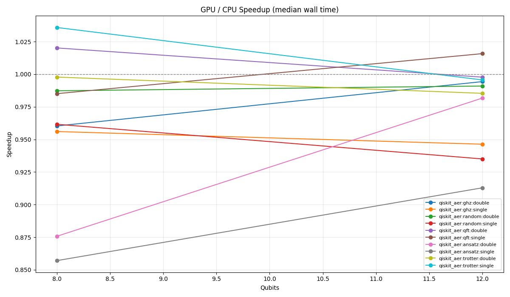
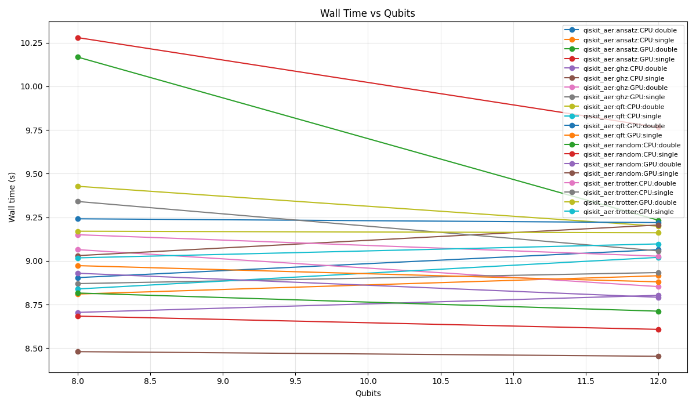
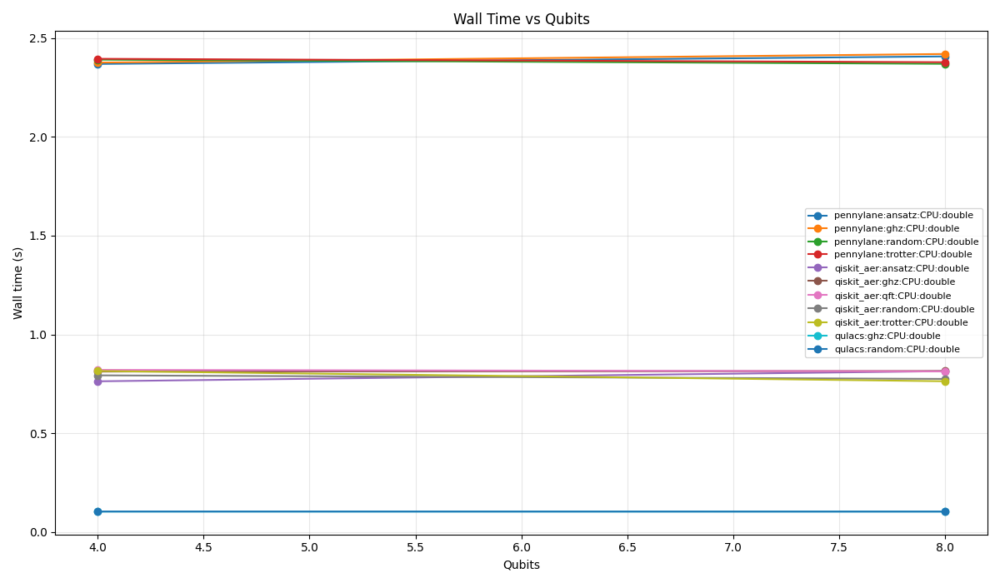

# Quantum Bench

[](#installation)
[](#installation)
[](#current-results-on-this-machine)
[](#current-mvp-scope)
[](./pyproject.toml)

Portable benchmark harness for quantum circuit simulation across CPU and NVIDIA GPU environments, designed for reproducible local validation on Windows/WSL2 and later migration to stronger Ubuntu workstations.

**Short description**

Quantum Bench standardizes how quantum circuit simulators are executed, measured, and compared across development and target machines, with emphasis on `Qiskit Aer`, `Qulacs`, `PennyLane Lightning`, and the practical behavior of NVIDIA-backed simulation paths.

The project is organized around two ideas:

- keep the benchmark pipeline portable across Windows, WSL2, and Ubuntu;
- separate quick validation runs from heavier hardware-focused campaigns.

## What it does

- Runs benchmark profiles from JSON config files
- Captures host, package, CUDA, and GPU metadata
- Measures wall time, CPU time, peak RSS, and GPU memory
- Compares results against a small exact reference simulator for correctness checks
- Writes CSV and JSON artifacts for later analysis
- Generates plots from result directories

## Quick Results

These numbers come from the current development machine and are preliminary.

### Environment comparison

| Dimension | Windows dev | WSL2 GPU |
|---|---|---|
| Primary goal | CPU validation and pipeline smoke testing | Real NVIDIA GPU execution path |
| Working CPU stacks | `Qiskit Aer`, `Qulacs`, `PennyLane` | `Qiskit Aer` |
| Working GPU stacks | none in the measured setup | `Qiskit Aer GPU` |
| Current usefulness | fast local development baseline | practical NVIDIA test bed on this machine |
| Main limitation | native GPU backends unavailable | short profile still dominated by fixed overhead |

| Environment | Stack | Scope | Outcome |
|---|---|---|---|
| Windows native | `Qiskit Aer`, `Qulacs`, `PennyLane` CPU | Small `dev` profile | CPU path worked across all three stacks |
| Windows native | GPU paths | Small `dev` profile | No working native GPU backend in the tested setup |
| WSL2 Ubuntu | `Qiskit Aer` CPU/GPU | `dev-wsl-gpu` profile | Real NVIDIA GPU execution worked |
| WSL2 Ubuntu | `Qiskit Aer` GPU speedup | `8-12` qubits | GPU mostly tied with CPU or slightly slower |
| WSL2 Ubuntu | `Qulacs` | `dev-wsl-gpu` profile | Not installed in the measured run |

Quick timing snapshot from the Windows CPU run:

| Library | Median wall time |
|---|---:|
| `Qulacs` | `~0.103 s` |
| `Qiskit Aer` | `~0.77-0.82 s` |
| `PennyLane Lightning` | `~2.35-2.46 s` |

Quick timing snapshot from the WSL2 GPU run:

| Stack | Range |
|---|---|
| `Qiskit Aer` CPU vs GPU speedup | `0.857x` to `1.036x` |
| Interpretation | GPU path works, but this short profile is too small to expose a clear win |

## How To Reproduce The Current Results

### Windows dev run

```powershell
py -3.13 -m venv .venv
.venv\Scripts\Activate.ps1
python -m pip install -U pip setuptools wheel
python -m pip install psutil matplotlib pynvml qiskit qiskit-aer qulacs pennylane pennylane-lightning
python -m quantum_bench env-report --output artifacts/env-report-win-venv.json
python -m quantum_bench capability-probe --output artifacts/capabilities-win-venv.json
python -m quantum_bench run --profile profiles/dev.json --capabilities artifacts/capabilities-win-venv.json
python -m quantum_bench plot --input-dir results/dev/<run-dir> --output-dir plots/dev-<run-dir>
```

### WSL2 GPU run

```bash
python3 -m venv .venv-wsl
source .venv-wsl/bin/activate
python -m pip install -U pip setuptools wheel
python -m pip install psutil matplotlib pynvml
python -m pip install qiskit==1.4.5 qiskit-aer-gpu
python -m quantum_bench env-report --output artifacts/env-report-wsl-gpu.json
python -m quantum_bench capability-probe --output artifacts/capabilities-wsl-gpu.json
python -m quantum_bench run --profile profiles/dev-wsl-gpu.json --capabilities artifacts/capabilities-wsl-gpu.json
python -m quantum_bench plot --input-dir results/dev-wsl-gpu/<run-dir> --output-dir plots/dev-wsl-gpu-<run-dir>
```

### Current measured runs in this repository

- Windows CPU-focused run:
  [results/dev/dev-windows_wsl_dev-2026-04-22T020839+0000](results/dev/dev-windows_wsl_dev-2026-04-22T020839+0000/manifest.json)
- WSL2 GPU-focused run:
  [results/dev-wsl-gpu/dev-wsl-gpu-wsl2_ubuntu_gpu_dev-2026-04-22T025554+0000](results/dev-wsl-gpu/dev-wsl-gpu-wsl2_ubuntu_gpu_dev-2026-04-22T025554+0000/manifest.json)

## Plots

### WSL2 GPU: CPU vs GPU speedup



### WSL2 GPU: time vs qubits



### Windows dev: time vs qubits



## Current MVP scope

- Libraries:
  - `Qiskit Aer`
  - `Qulacs`
  - `PennyLane Lightning`
- Circuit families:
  - `ghz`
  - `qft`
  - `random`
  - `ansatz`
  - `trotter`
- Commands:
  - `run`
  - `plot`
  - `env-report`
  - `capability-probe`

Out of scope for this version:

- `qsim/Cirq`
- `ProjectQ`
- density-matrix and noise campaigns
- `W`, `HHL`, and `SupermarQ`

## Project layout

```text
quantum_bench/
  adapters/          backend-specific execution
  capability.py      RAM/VRAM estimation
  cli.py             command entrypoints
  config.py          profile expansion
  env_report.py      machine metadata
  plotting.py        plot generation
  recipes.py         canonical circuit recipes
  reference.py       small exact simulator for correctness checks
  runner.py          isolated case execution and CSV/JSON writing

profiles/
  dev.json
  full.json
  dev-wsl-gpu.json
```

## Profiles

The repository ships with three profiles:

- `profiles/dev.json`
  Short development profile for Windows CPU and partial GPU-path validation.
- `profiles/full.json`
  Larger campaign driven by `capability-probe`, intended for the stronger target workstation.
- `profiles/dev-wsl-gpu.json`
  WSL2/Linux-oriented development profile focused on real NVIDIA GPU runs with `Qiskit Aer`.

## Installation

### Windows development environment

Use this for CPU runs and basic pipeline validation.

```powershell
py -3.13 -m venv .venv
.venv\Scripts\Activate.ps1
python -m pip install -U pip setuptools wheel
python -m pip install psutil matplotlib pynvml qiskit qiskit-aer qulacs pennylane pennylane-lightning
```

Run directly from the repository root:

```powershell
.venv\Scripts\python.exe -m quantum_bench --help
```

### WSL2 / Ubuntu GPU environment

Use this for the NVIDIA path. On the current machine, this is the only route that successfully executed real GPU simulations.

```bash
python3 -m venv .venv-wsl
source .venv-wsl/bin/activate
python -m pip install -U pip setuptools wheel
python -m pip install psutil matplotlib pynvml
python -m pip install qiskit==1.4.5 qiskit-aer-gpu
```

Notes:

- `Qiskit Aer GPU` worked in WSL2 after pinning `qiskit==1.4.5`.
- Native Windows GPU execution did not work for the tested setup.
- `qulacs-gpu` was not installed in WSL2 during the current runs because it requires a local build toolchain.

## Commands

### 1. Environment report

```bash
python -m quantum_bench env-report --output artifacts/env-report.json
```

Generates hardware, OS, Python, package, and CUDA metadata.

### 2. Capability probe

```bash
python -m quantum_bench capability-probe --output artifacts/capabilities.json
```

Estimates safe RAM and VRAM envelopes for statevector experiments.

### 3. Run a profile

Windows development run:

```powershell
.venv\Scripts\python.exe -m quantum_bench run --profile profiles/dev.json --capabilities artifacts/capabilities-win-venv.json
```

WSL2 GPU run:

```bash
.venv-wsl/bin/python -m quantum_bench run --profile profiles/dev-wsl-gpu.json --capabilities artifacts/capabilities-wsl-gpu.json
```

Larger workstation-oriented run:

```bash
python -m quantum_bench run --profile profiles/full.json --capabilities artifacts/capabilities.json
```

### 4. Generate plots

```bash
python -m quantum_bench plot --input-dir results/dev/... --output-dir plots/dev
```

Typical outputs:

- `time_vs_qubits.png`
- `ram_vs_qubits.png`
- `vram_vs_qubits.png`
- `gpu_cpu_speedup.png`
- `fidelity_vs_qubits.png`
- `summary.json`

## Result files

Each run creates a timestamped directory containing:

- `env-report.json`
- `capability-report.json`
- `manifest.json`
- `results.csv`
- `results.json`
- optional `analysis-summary.json`

Important CSV columns:

- `wall_s`
  Total wall-clock time in seconds for the case.
- `cpu_s`
  CPU time consumed by the process.
- `peak_rss_mb`
  Peak resident memory in MB.
- `gpu_peak_mem_mb`
  Peak GPU memory observed in MB.
- `state_fidelity_ref`
  Fidelity against the small exact reference simulator when the qubit count is within the reference budget.

## Current results on this machine

These are preliminary numbers from the current development machine, not the final workstation target.

### Windows dev run

Source:

- [analysis-summary.json](results/dev/dev-windows_wsl_dev-2026-04-22T020839+0000/analysis-summary.json)

Headline results:

- Non-warmup success rate: `58.06%`
- CPU succeeded on all tested `Qiskit Aer`, `Qulacs`, and `PennyLane` cases
- GPU failed on all tested Windows-native cases

CPU median wall times from the current small profile:

- `Qulacs`: about `0.103 s`
- `Qiskit Aer`: about `0.77-0.82 s`
- `PennyLane Lightning`: about `2.35-2.46 s`

Observed Windows-native GPU failures:

- `Qiskit Aer`: `Simulation device "GPU" is not supported on this system`
- `PennyLane`: `lightning.gpu` device not available
- `Qulacs`: GPU backend not available

Interpretation:

- For this machine, Windows native is useful for CPU comparisons and pipeline validation.
- It is not the right path for the NVIDIA performance study.

### WSL2 GPU run

Source:

- [analysis-summary.json](results/dev-wsl-gpu/dev-wsl-gpu-wsl2_ubuntu_gpu_dev-2026-04-22T025554+0000/analysis-summary.json)

Headline results:

- Non-warmup success rate: `84.21%`
- `Qiskit Aer` succeeded on both CPU and GPU
- `Qulacs` did not run because it was not installed in the WSL environment used for the measured run

`Qiskit Aer` CPU vs GPU on this machine, `8-12` qubits:

- observed speedups ranged from about `0.857x` to `1.036x`
- GPU mostly tied with CPU or came out slightly slower in this short profile

Interpretation:

- The NVIDIA path is working in `WSL2` with `Qiskit Aer GPU`.
- For the current qubit range and this runner shape, the GPU does not yet show a clear advantage.
- The likely reason is that the profile is still too small and the fixed overhead dominates.

## Known caveats

- The GPU study is not complete yet. It currently has strong evidence for `Qiskit Aer GPU` in WSL2, but not yet for `Qulacs GPU` or `PennyLane lightning.gpu`.
- Some fidelity values are suspicious, especially around `QFT`. That likely indicates a harness-side issue such as qubit ordering or backend mapping, not necessarily a simulator failure.
- The current development profiles are intentionally small and include substantial startup overhead. They validate the pipeline, but they are not yet the final hardware characterization methodology.

## Recommended next steps

- Fix the fidelity/reference mismatch for `QFT` and any other backend-ordering issues
- Reduce fixed runner overhead for GPU-focused campaigns
- Expand the WSL2 GPU profile to larger qubit counts
- Add a working `qulacs-gpu` toolchain in WSL2
- Re-run the full campaign on the stronger target workstation

## Roadmap

- `v0.2`
  Fix correctness issues in the reference comparison layer, especially around `QFT` and possible qubit-ordering mismatches.
- `v0.3`
  Improve GPU methodology by reducing per-case startup overhead and expanding WSL2 GPU campaigns to larger qubit counts.
- `v0.4`
  Bring up `qulacs-gpu` and, if possible, `PennyLane lightning.gpu` on the Linux path.
- `v0.5`
  Run the `full` profile on the stronger target workstation and publish a cleaner benchmark report.
- `v1.0`
  Add a stable comparison set across CPU, GPU, correctness, and resource usage with reproducible published artifacts.

## Notes

- The runner imports heavy quantum frameworks lazily, per case.
- Failures are recorded as result rows instead of aborting the whole campaign.
- Generated directories such as `results/`, `plots/`, and `artifacts/` are intentionally ignored by git in this repository.
