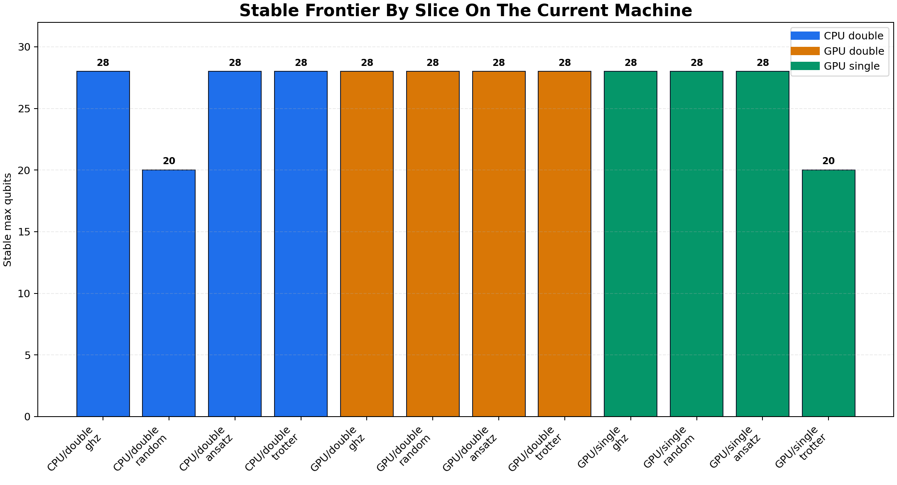
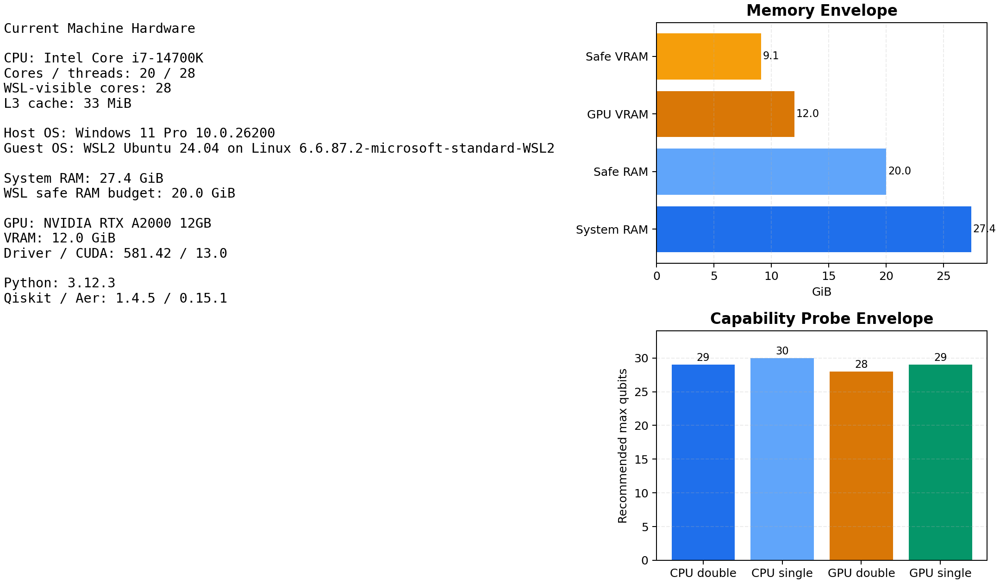
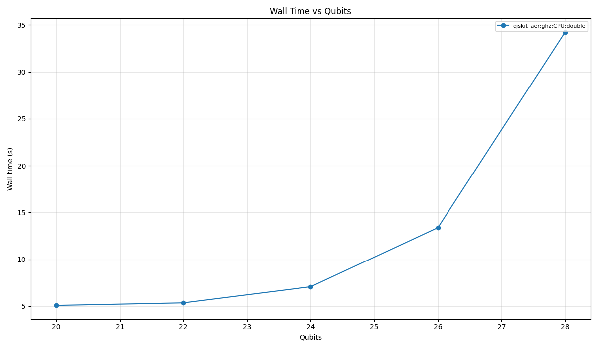
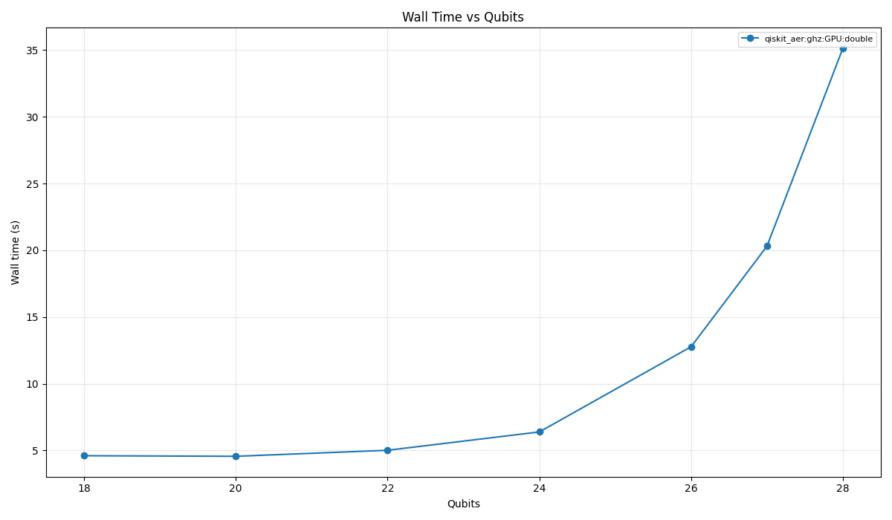
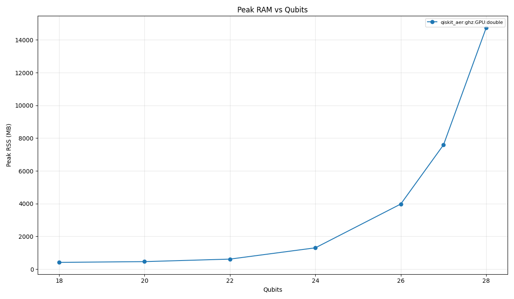
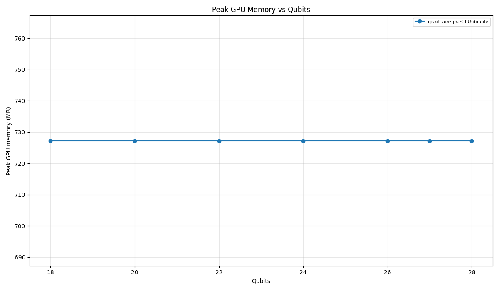
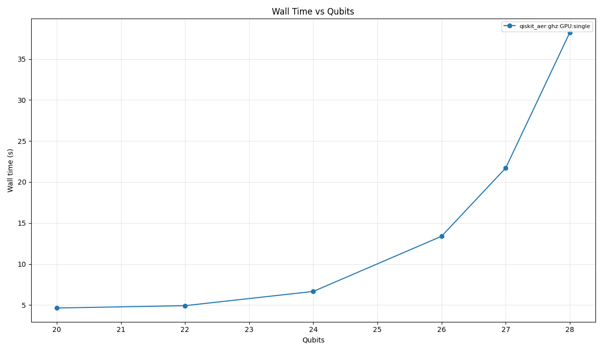

# Quantum Bench

[](#installation)
[](#installation)
[](#current-results-on-this-machine)
[](#current-mvp-scope)
[](./pyproject.toml)

Portable benchmark harness for quantum circuit simulation across CPU and NVIDIA GPU environments, designed for reproducible local validation on Windows/WSL2 and later migration to stronger Ubuntu workstations.

**Short description**

Quantum Bench standardizes how quantum circuit simulators are executed, measured, and compared across development and target machines, with emphasis on `Qiskit Aer`, `Qulacs`, `PennyLane Lightning`, and the practical behavior of NVIDIA-backed simulation paths.

The project is organized around two ideas:

- keep the benchmark pipeline portable across Windows, WSL2, and Ubuntu;
- separate quick validation runs from heavier hardware-focused campaigns.
- for frontier-style campaigns on WSL2, prefer a Windows-hosted orchestrator that launches one case at a time inside WSL so a single hard crash does not destroy the whole run.

## What it does

- Runs benchmark profiles from JSON config files
- Captures host, package, CUDA, and GPU metadata
- Measures wall time, CPU time, peak RSS, and GPU memory
- Compares results against a small exact reference simulator for correctness checks
- Writes CSV, JSON, and Markdown artifacts for later analysis
- Generates plots from result directories

## Current Benchmark Report

The repository now includes a GitHub-safe benchmark report for the current machine, based on the validated `WSL2 + Qiskit Aer GPU` path and the clean-start frontier methodology.

- Canonical report: [docs/reports/current-machine-frontier.md](docs/reports/current-machine-frontier.md)
- Structured summary: [docs/data/current-machine-frontier.json](docs/data/current-machine-frontier.json)
- Hardware specification: [docs/data/current-machine-hardware.json](docs/data/current-machine-hardware.json)
- Public repo policy: [docs/reports/public-repo-guidelines.md](docs/reports/public-repo-guidelines.md)

Headline frontier from the current machine:

| Slice | Stable max measured | Highest tested | Reading |
|---|---:|---:|---|
| `CPU / double / ghz` | 28 | 29 | `29q` became unstable |
| `GPU / double / ghz` | 28 | 29 | dedicated `29q` probe failed |
| `GPU / single / ghz` | 28 | 29 | `29q` became unstable |
| `CPU / double / random` | 20 | 29 | stability dropped sharply after `20q` |
| `GPU / single / trotter` | 20 | 29 | stability dropped sharply after `20q` |

Working interpretation:

- `WSL2` is the canonical NVIDIA path for this machine.
- The clean-start per-slice runs are the canonical frontier measurements.
- The sustained batch campaign is still useful, but it acts more like an endurance test than a clean ceiling measurement.

### Public-safe overview





### Detailed hardware specification

| Component | Current machine |
|---|---|
| Host OS | `Windows 11 Pro 10.0.26200` |
| Guest OS | `WSL2 Ubuntu 24.04` on `Linux 6.6.87.2-microsoft-standard-WSL2` |
| CPU | `Intel Core i7-14700K` |
| Physical cores / logical threads | `20 / 28` |
| System RAM | `27.4 GiB` |
| Safe RAM budget used by the probe | `20.0 GiB` |
| GPU | `NVIDIA RTX A2000 12GB` |
| VRAM | `12.0 GiB` |
| Safe VRAM budget used by the probe | `9.1 GiB` |
| Driver / CUDA | `581.42 / 13.0` |
| Python / Qiskit / Aer | `3.12.3 / 1.4.5 / 0.15.1` |

### Selected figures

CPU double GHZ:



GPU double GHZ:







GPU single GHZ:



For the full write-up, methodology notes, and the structured public-safe summaries, see:

- [docs/reports/current-machine-frontier.md](docs/reports/current-machine-frontier.md)
- [docs/data/current-machine-frontier.json](docs/data/current-machine-frontier.json)
- [docs/data/current-machine-hardware.json](docs/data/current-machine-hardware.json)

## Why WSL2 Instead Of Native Windows GPU

For the current machine and tested stack, `WSL2` was the only path that produced a real NVIDIA-backed run with `Qiskit Aer GPU`.

In the measured setup:

- native Windows CPU runs worked well for `Qiskit Aer`, `Qulacs`, and `PennyLane`;
- native Windows GPU runs failed across the tested backends;
- `WSL2` with Ubuntu and `qiskit==1.4.5` plus `qiskit-aer-gpu` successfully executed GPU simulations on the `RTX A2000 12GB`.

Practical conclusion:

- use Windows native for fast development and CPU-side validation;
- use `WSL2` or Ubuntu native when the actual goal is evaluating NVIDIA GPU behavior.

## How To Reproduce The Current Results

### Windows dev run

```powershell
py -3.13 -m venv .venv
.venv\Scripts\Activate.ps1
python -m pip install -U pip setuptools wheel
python -m pip install psutil matplotlib pynvml qiskit qiskit-aer qulacs pennylane pennylane-lightning
python -m quantum_bench env-report --output artifacts/env-report-win-venv.json
python -m quantum_bench capability-probe --output artifacts/capabilities-win-venv.json
python -m quantum_bench run --profile profiles/dev.json --capabilities artifacts/capabilities-win-venv.json
python -m quantum_bench plot --input-dir results/dev/<run-dir> --output-dir plots/dev-<run-dir>
```

### WSL2 GPU run

```bash
python3 -m venv .venv-wsl
source .venv-wsl/bin/activate
python -m pip install -U pip setuptools wheel
python -m pip install psutil matplotlib pynvml
python -m pip install qiskit==1.4.5 qiskit-aer-gpu
python -m quantum_bench env-report --output artifacts/env-report-wsl-gpu.json
python -m quantum_bench capability-probe --output artifacts/capabilities-wsl-gpu.json
python -m quantum_bench run --profile profiles/dev-wsl-gpu.json --capabilities artifacts/capabilities-wsl-gpu.json
python -m quantum_bench report --input-dir results/dev-wsl-gpu/<run-dir>
python -m quantum_bench plot --input-dir results/dev-wsl-gpu/<run-dir> --output-dir plots/dev-wsl-gpu-<run-dir>
```

### WSL2 frontier run

Use this when the goal is to push the current machine close to its practical statevector frontier on the validated NVIDIA path.

```bash
python3 -m venv .venv-wsl
source .venv-wsl/bin/activate
python -m pip install -U pip setuptools wheel
python -m pip install psutil matplotlib pynvml qiskit-aer-gpu
python -m quantum_bench env-report --output artifacts/env-report-wsl-frontier.json
python -m quantum_bench capability-probe --output artifacts/capabilities-wsl-frontier.json
python -m quantum_bench run --profile profiles/frontier-wsl-gpu.json --capabilities artifacts/capabilities-wsl-frontier.json
python -m quantum_bench report --input-dir results/frontier-wsl-gpu/<run-dir>
python -m quantum_bench plot --input-dir results/frontier-wsl-gpu/<run-dir> --output-dir plots/frontier-wsl-gpu-<run-dir>
```

### WSL2 clean-slice frontier run

Use this when you want the most reliable frontier data on the current machine. It runs each `(device, precision, family)` slice independently, reuses a cached WSL environment report, and writes a campaign-level summary in addition to the per-run artifacts.

```powershell
python -m quantum_bench env-report --output artifacts/env-report-wsl-frontier.json
python -m quantum_bench capability-probe --output artifacts/capabilities-wsl-frontier.json
.\scripts\run_wsl_frontier_precision.ps1 -ResultsRoot results/frontier-wsl-precision-campaign -PlotsRoot plots/frontier-wsl-precision-campaign -Resume
```

For a single clean confirmation slice, use `-SelectedSlice`, for example:

```powershell
.\scripts\run_wsl_frontier_precision.ps1 -SelectedSlice gpu-single-ghz -ResultsRoot results/frontier-wsl-precision-gpu-single-ghz-clean -PlotsRoot plots/frontier-wsl-precision-gpu-single-ghz-clean -Resume
```

If the first `qiskit-aer-gpu` install resolves to an incompatible `qiskit` combination in your WSL environment, fall back to:

```bash
python -m pip install qiskit==1.4.5 qiskit-aer-gpu
```

Optional secondary extension for `Qulacs` after the main `Qiskit Aer` frontier run:

```bash
python -m pip install qulacs-gpu
python -m quantum_bench run --profile profiles/frontier-wsl-qulacs.json --capabilities artifacts/capabilities-wsl-frontier.json
python -m quantum_bench report --input-dir results/frontier-wsl-qulacs/<run-dir>
python -m quantum_bench plot --input-dir results/frontier-wsl-qulacs/<run-dir> --output-dir plots/frontier-wsl-qulacs-<run-dir>
```

### Committed benchmark artifacts

- [Current machine frontier report](docs/reports/current-machine-frontier.md)
- [Current machine frontier JSON](docs/data/current-machine-frontier.json)
- [Current machine hardware JSON](docs/data/current-machine-hardware.json)
- [Public repository guidelines](docs/reports/public-repo-guidelines.md)
- Curated benchmark figures under [`docs/assets/`](docs/assets)

### What should stay public vs local

Safe to commit:

- source code, profiles, scripts, and curated docs under `docs/`
- public-safe JSON summaries under `docs/data/`
- curated plots under `docs/assets/`

Keep local only:

- raw timestamped runs under `results/`
- raw generated plots under `plots/`
- local machine snapshots under `artifacts/`
- local environments and temporary directories such as `.venv/`, `.venv-wsl/`, and `.campaign-temp/`
- any file that exposes usernames, full local paths, temporary directories, hostnames, or raw environment-variable dumps

The raw timestamped machine outputs that generated those summaries remain local under `results/`, `plots/`, and `artifacts/`. They are intentionally kept out of Git so the repository stays readable and commit-safe.

## Current MVP scope

- Libraries:
  - `Qiskit Aer`
  - `Qulacs`
  - `PennyLane Lightning`
- Circuit families:
  - `ghz`
  - `qft`
  - `random`
  - `ansatz`
  - `trotter`
- Commands:
  - `run`
  - `run-wsl`
  - `plot`
  - `report`
  - `env-report`
  - `capability-probe`

Out of scope for this version:

- `qsim/Cirq`
- `ProjectQ`
- density-matrix and noise campaigns
- `W`, `HHL`, and `SupermarQ`

## Project layout

```text
quantum_bench/
  adapters/          backend-specific execution
  capability.py      RAM/VRAM estimation
  cli.py             command entrypoints
  config.py          profile expansion
  env_report.py      machine metadata
  plotting.py        plot generation
  reporting.py       JSON/Markdown analysis summaries
  recipes.py         canonical circuit recipes
  reference.py       small exact simulator for correctness checks
  runner.py          isolated case execution and CSV/JSON writing

docs/
  assets/            committed plots used in the public report
  data/              committed machine-summary JSON
  reports/           GitHub-safe benchmark reports

profiles/
  dev.json
  full.json
  dev-wsl-gpu.json
  frontier-wsl-gpu.json
  frontier-wsl-qulacs.json

scripts/
  run_wsl_frontier_precision.ps1
```

## Profiles

The repository ships with five profiles:

- `profiles/dev.json`
  Short development profile for Windows CPU and partial GPU-path validation.
- `profiles/full.json`
  Larger campaign driven by `capability-probe`, intended for the stronger target workstation.
- `profiles/dev-wsl-gpu.json`
  WSL2/Linux-oriented development profile focused on real NVIDIA GPU runs with `Qiskit Aer`.
- `profiles/frontier-wsl-gpu.json`
  WSL2/Linux frontier profile focused on the heaviest validated `Qiskit Aer` CPU/GPU statevector cases on the current class of machine.
- `profiles/frontier-wsl-qulacs.json`
  Shorter WSL2/Linux extension profile for `Qulacs` CPU/GPU after the main frontier run.

The frontier profiles also enable `frontier_stop_on_failure`, so once a qubit level fails for a given `(library, backend, device, precision, family)` slice, the remaining equal-or-higher cases in that slice are pruned instead of repeatedly hammering the same unstable boundary.

## Installation

### Windows development environment

Use this for CPU runs and basic pipeline validation.

```powershell
py -3.13 -m venv .venv
.venv\Scripts\Activate.ps1
python -m pip install -U pip setuptools wheel
python -m pip install psutil matplotlib pynvml qiskit qiskit-aer qulacs pennylane pennylane-lightning
```

Run directly from the repository root:

```powershell
.venv\Scripts\python.exe -m quantum_bench --help
```

### WSL2 / Ubuntu GPU environment

Use this for the NVIDIA path. On the current machine, this is the only route that successfully executed real GPU simulations.

```bash
python3 -m venv .venv-wsl
source .venv-wsl/bin/activate
python -m pip install -U pip setuptools wheel
python -m pip install psutil matplotlib pynvml
python -m pip install qiskit==1.4.5 qiskit-aer-gpu
```

Notes:

- `Qiskit Aer GPU` worked in WSL2 after pinning `qiskit==1.4.5`.
- Native Windows GPU execution did not work for the tested setup.
- `qulacs-gpu` was not installed in WSL2 during the current runs because it requires a local build toolchain.
- For the frontier workflow, try `pip install qiskit-aer-gpu` first and keep the pinned `qiskit==1.4.5` fallback if the resolved combination does not execute GPU cases correctly.

## Commands

### 1. Environment report

```bash
python -m quantum_bench env-report --output artifacts/env-report.json
```

Generates hardware, OS, Python, package, and CUDA metadata.

### 2. Capability probe

```bash
python -m quantum_bench capability-probe --output artifacts/capabilities.json
```

Estimates safe RAM and VRAM envelopes for statevector experiments.

### 3. Run a profile

Windows development run:

```powershell
.venv\Scripts\python.exe -m quantum_bench run --profile profiles/dev.json --capabilities artifacts/capabilities-win-venv.json
```

WSL2 GPU run:

```bash
.venv-wsl/bin/python -m quantum_bench run --profile profiles/dev-wsl-gpu.json --capabilities artifacts/capabilities-wsl-gpu.json
```

Larger workstation-oriented run:

```bash
python -m quantum_bench run --profile profiles/full.json --capabilities artifacts/capabilities.json
```

Frontier WSL2 GPU run:

```bash
python -m quantum_bench run --profile profiles/frontier-wsl-gpu.json --capabilities artifacts/capabilities-wsl-frontier.json
```

Recommended frontier run from Windows host with WSL execution isolation:

```powershell
python -m quantum_bench run-wsl --profile profiles/frontier-wsl-gpu.json --capabilities artifacts/capabilities-wsl-frontier.json --repo-root . --wsl-python .venv-wsl/bin/python
```

This mode launches one benchmark case per `wsl` invocation, which is much more resilient near the hardware limit because a single WSL-side crash is recorded as a failed case instead of taking down the entire campaign.

To regenerate the committed public plots from the curated JSON files:

```powershell
python scripts/generate_public_report_assets.py
```

### 4. Generate analysis report

```bash
python -m quantum_bench report --input-dir results/frontier-wsl-gpu/...
```

Typical outputs:

- `analysis-summary.json`
- `analysis-report.md`

### 5. Generate plots

```bash
python -m quantum_bench plot --input-dir results/dev/... --output-dir plots/dev
```

Typical outputs:

- `time_vs_qubits.png`
- `ram_vs_qubits.png`
- `vram_vs_qubits.png`
- `gpu_cpu_speedup.png`
- `fidelity_vs_qubits.png`
- `summary.json`

## Result files

Each run creates a timestamped directory containing:

- `env-report.json`
- `capability-report.json`
- `manifest.json`
- `results.csv`
- `results.json`
- `analysis-summary.json` after running `report`
- `analysis-report.md` after running `report`

Important CSV columns:

- `wall_s`
  Total wall-clock time in seconds for the case.
- `cpu_s`
  CPU time consumed by the process.
- `peak_rss_mb`
  Peak resident memory in MB.
- `gpu_peak_mem_mb`
  Peak GPU memory observed in MB.
- `state_fidelity_ref`
  Fidelity against the small exact reference simulator when the qubit count is within the reference budget.

## Current results on this machine

The canonical committed summary is [docs/reports/current-machine-frontier.md](docs/reports/current-machine-frontier.md). It replaces the earlier ad hoc README snapshots with a clean-start frontier report, a structured JSON summary, and curated plots that are safe to keep in Git.

Local raw artifacts still exist for the full investigation, but they remain intentionally gitignored because they are timestamped, bulky, and specific to this workstation.

## Known caveats

- The GPU study is not complete yet. It currently has strong evidence for `Qiskit Aer GPU` in WSL2, but not yet for `Qulacs GPU` or `PennyLane lightning.gpu`.
- Some fidelity values are suspicious, especially around `QFT`. That likely indicates a harness-side issue such as qubit ordering or backend mapping, not necessarily a simulator failure.
- The older development profiles are intentionally small and still useful for smoke testing, but the canonical frontier characterization now comes from the clean-start slice campaign documented under `docs/`.

## Limitations

- The current benchmark harness still has noticeable fixed overhead from process startup and framework initialization, especially in GPU-oriented runs.
- The present GPU evidence is strongest for `Qiskit Aer` in `WSL2`; it is not yet a broad statement about every simulator.
- `qulacs-gpu` is not part of the measured Linux GPU results yet, because the current environment did not include the required build toolchain.
- `PennyLane lightning.gpu` is not part of the measured success path yet on this machine.
- Some correctness metrics, especially around `QFT`, likely still contain backend-ordering or reference-comparison issues.
- The repository now contains a much stronger machine-specific frontier characterization, but it is still a local benchmark campaign rather than a cross-lab publication package.

## Recommended next steps

- Fix the fidelity/reference mismatch for `QFT` and any other backend-ordering issues
- Reduce fixed runner overhead for GPU-focused campaigns
- Expand the WSL2 GPU profile to larger qubit counts
- Add a working `qulacs-gpu` toolchain in WSL2
- Re-run the full campaign on the stronger target workstation

## Roadmap

- `v0.2`
  Fix correctness issues in the reference comparison layer, especially around `QFT` and possible qubit-ordering mismatches.
- `v0.3`
  Improve GPU methodology by reducing per-case startup overhead and expanding WSL2 GPU campaigns to larger qubit counts.
- `v0.4`
  Bring up `qulacs-gpu` and, if possible, `PennyLane lightning.gpu` on the Linux path.
- `v0.5`
  Run the `full` profile on the stronger target workstation and publish a cleaner benchmark report.
- `v1.0`
  Add a stable comparison set across CPU, GPU, correctness, and resource usage with reproducible published artifacts.

## Notes

- The runner imports heavy quantum frameworks lazily, per case.
- Failures are recorded as result rows instead of aborting the whole campaign.
- Raw generated directories such as `results/`, `plots/`, and `artifacts/` are intentionally ignored by git. The committed benchmark record now lives under `docs/`.
