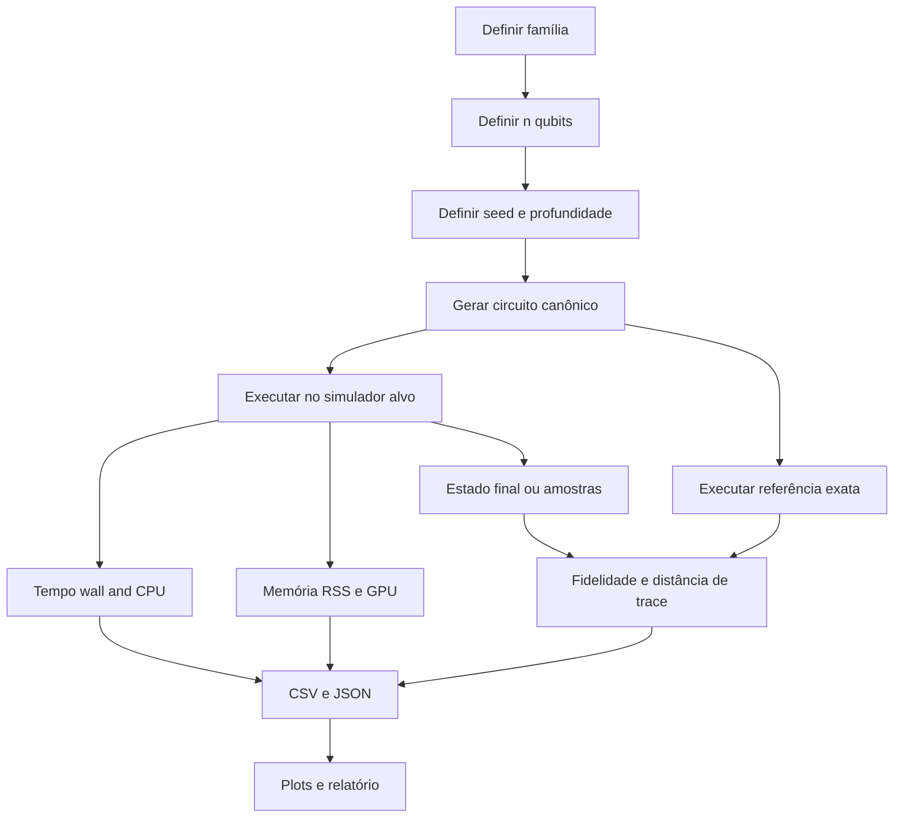

# Pesquisa profunda sobre benchmarks locais para simulação de circuitos quânticos

## Resumo executivo

Para uma bateria séria de benchmarks em PC pessoal, a combinação mais equilibrada hoje é: **Qiskit Aer** como referência geral de métodos de simulação; **qsimcirq** quando o foco é velocidade em circuitos puros no ecossistema Cirq; **Qulacs** para estado vetorial rápido em CPU/GPU com controle explícito de threads; **PennyLane** com `lightning.qubit` e `lightning.gpu` quando você quer aproximar o benchmark de fluxos variacionais e híbridos; e **ProjectQ** principalmente quando você quer comparar um simulador C++ com contador de recursos embutido. Em termos de baseline de compatibilidade entre ferramentas, **Python 3.11** é o ponto mais seguro: Cirq exige 3.11+, PennyLane/Lightning também, qsimcirq oferece wheels para 3.10–3.13, e Qulacs documenta suporte a Python 3.9+. citeturn30view0turn26view1turn22view0turn28view0

No estado atual da documentação oficial, o caminho **mais simples com GPU NVIDIA** continua sendo **Linux x86_64**. Em Qiskit Aer, as páginas de “getting started” ainda mencionam CUDA 10.1+, mas as release notes mais recentes elevam o mínimo efetivo para **CUDA 11.2+** e separam os pacotes `qiskit-aer-gpu-cu11` e `qiskit-aer-gpu` para CUDA 12; além disso, o wheel oficial de GPU continua restrito a Linux x86_64. No ecossistema PennyLane Lightning, `lightning.gpu` e `lightning.tensor` existem oficialmente, mas a documentação detalhada de build com cuQuantum é claramente mais confortável no Linux. No ecossistema Cirq, o suporte de alto desempenho via qsim/qsimcirq também é melhor documentado no Linux, embora existam wheels para Windows e macOS. citeturn24view2turn25view0turn26view1turn26view2turn22view0turn23view0

Para a **matriz experimental**, eu recomendo separar dois objetivos: **throughput** e **corretude**. Para throughput, use principalmente **GHZ, QFT, camadas aleatórias, ansätze variacionais e evolução Trotterizada** em 2–30 qubits. Para corretude, mantenha um conjunto pequeno com **GHZ, W, QFT em estados base conhecidos, HHL toy** e **Trotter Ising pequeno**, porque eles permitem referência analítica ou exata. Para precisão, use pelo menos **fidelidade de estado** e **distância de trace**; para canais/noise, complemente com **process fidelity** ou **average gate fidelity** quando fizer sentido. Qiskit, Cirq e PennyLane documentam explicitamente fidelidade e/ou distância de trace; no kit abaixo eu padronizo o cálculo com NumPy/SciPy para não depender de uma única API. citeturn15search0turn16search0turn14search0turn17search1

## Panorama dos simuladores

A tabela abaixo resume o que interessa para um benchmark local: método de representação, dependências, paralelismo, precisão, GPU e observações práticas. Onde a limitação real depende de RAM/entanglement, eu prefiro explicitar isso em vez de prometer um “número mágico de qubits”, porque a própria documentação faz essa distinção. citeturn24view0turn30view1turn23view0turn28view0turn29view1turn26view1

| Ferramenta | Perfil principal | Representações / métodos | Dependências e requisitos oficiais | GPU | Paralelismo | Precisão | Observação prática | Links oficiais |
|---|---|---|---|---|---|---|---|---|
| Qiskit Aer | suíte geral de referência | `statevector`, `density_matrix`, `stabilizer`, `extended_stabilizer`, `matrix_product_state`, `unitary`, `superop`, `tensor_network` | depende do Qiskit SDK; instalação via `pip install qiskit-aer` | sim, em métodos selecionados | OpenMP; paralelismo por circuitos/shots; executor customizado | `single` ou `double` em vários métodos | melhor “canivete suíço”; MPS e extended stabilizer ajudam além do dense statevector | documentação oficial citeturn24view0turn24view2 |
| Qiskit Aer GPU | referência geral com aceleração CUDA | `statevector`, `density_matrix`, `unitary` e `tensor_network` (GPU-only) | GPU wheels oficiais em Linux x86_64; CUDA 11.2+ nas release notes atuais; pacote separado para CUDA 11 | sim | OpenMP + multi-GPU/MPI em cenários suportados | `single` ou `double`; cuStateVec opcional | melhor opção se você quer comparar CPU vs GPU dentro do mesmo stack | documentação oficial citeturn24view0turn25view0turn8search0 |
| Cirq | framework + simuladores Python embutidos | `cirq.Simulator` e `cirq.DensityMatrixSimulator` | Python 3.11+; `pip install cirq` | não no núcleo do Cirq | simuladores Python; foco em ergonomia e testes/correção | `complex64` por padrão; `complex128` opcional | excelente para prototipagem e validação; menos indicado para o topo de performance | documentação oficial citeturn30view0turn30view1turn20search6turn20search14 |
| qsimcirq | simulador rápido no ecossistema Cirq | full statevector Schrödinger; opções CPU/GPU; também qsimh | wheels para Linux/macOS/Windows; qsimcirq suporta Python 3.10–3.13 | sim, com opções GPU/cuStateVec | `cpu_threads`, `max_fused_gate_size`, knobs GPU | documentação enfatiza performance e até menciona pequena perda de precisão ao zerar denormais | para circuitos puros de médio porte, normalmente supera o Cirq embutido | documentação oficial citeturn22view0turn30view2turn30view3turn23view0 |
| Qulacs | simulador statevector/density matrix rápido | `QuantumState`, `DensityMatrix`, versão GPU `QuantumStateGpu` | `pip install qulacs`; GPU com `pip install qulacs-gpu`; Python >= 3.9 | sim | OpenMP; `OMP_NUM_THREADS` ou `QULACS_NUM_THREADS` | `complex128` documentado | excelente candidato para benchmark “desempenho bruto” | documentação oficial citeturn28view0turn19search0turn28view1 |
| ProjectQ | simulador C++ + contagem de recursos | simulador C++ com fallback Python; `ResourceCounter` | `pip install projectq`; wheels pré-compilados exigem AVX2 | não | OpenMP (`OMP_NUM_THREADS`) | sem seletor explícito de precisão na página principal | útil para comparar compilação/contagem de portas e um simulador C++ clássico | documentação oficial citeturn29view0turn29view1 |
| PennyLane `default.qubit` | baseline simples e correto | simulador qubit padrão do PennyLane | `pip install pennylane`; cross-platform | não | pode usar `max_workers` em execuções assíncronas/processos | depende do backend matemático; foco é simplicidade/corretude | bom baseline funcional, não o melhor referência de desempenho | documentação oficial citeturn27search0turn26view3turn5search1 |
| PennyLane Lightning | simuladores de alto desempenho para workflows variacionais | `lightning.qubit`, `lightning.kokkos`, `lightning.gpu`, `lightning.tensor` | Python 3.11+; build GPU detalhado com cuQuantum/custatevec | sim, inclusive tensor-network | OpenMP, SIMD, Kokkos, MPI dependendo do backend | stack de alta performance | a melhor opção quando seu benchmark quer parecer VQE/QML real | documentação oficial citeturn26view1turn26view2turn4search9 |

A implicação prática dessa tabela é simples: se você quer **comparabilidade ampla**, use Qiskit Aer como eixo principal; se quer **teto de desempenho em circuitos puros**, compare Qulacs e qsimcirq; se quer **benchmark de ansatz/gradientes/fluxo híbrido**, inclua PennyLane Lightning; e se quer **contagem de recursos e um backend C++ maduro**, inclua ProjectQ. Essa recomendação é uma inferência direta da combinação de funcionalidades e escopo documentados por entity["organization","IBM","technology company"], entity["organization","Google","technology company"], entity["organization","QunaSys","quantum software company"] e entity["organization","Xanadu","quantum software company"]. citeturn24view0turn30view1turn23view0turn28view0turn26view1turn29view0

Em simuladores densos, o limite real é quase sempre memória. A documentação do Qiskit Aer explicita que um statevector de \(n\) qubits usa \(2^n\) valores complexos e cita **16 bytes por amplitude** no caso complexo em dupla precisão; a documentação do Qulacs diz que `QuantumState` aloca \(2^n\) complexos em `complex128`; a documentação do Cirq permite `complex64` ou `complex128`; e a documentação do qsim dá uma regra de bolso de **\(8 \cdot 2^N\) bytes** para seu estado vetorial. Em termos práticos, isso significa algo como **30 qubits em 16 GB** para dense statevector complex128, **31 qubits em 32 GB**, **32 qubits em 64 GB**; já **density matrix** cresce como \(2^{2n}\) e costuma se tornar desktop-hostile acima de ~14–16 qubits em dupla precisão. MPS/tensor network podem ir além disso quando o entrelaçamento é moderado. citeturn24view0turn19search0turn20search6turn20search14turn23view0

## Circuitos de benchmark

O conjunto de referência abaixo foi pensado para cobrir **estruturas de entrelaçamento diferentes**, **profundidades diferentes** e **padrões de acesso à memória diferentes**. Em benchmarks reais, isso é mais importante do que “rodar um único circuito aleatório grande”, porque simuladores diferentes favorecem estruturas diferentes. O Qiskit Aer documenta explicitamente a existência de métodos especializados como `matrix_product_state`, `stabilizer` e `extended_stabilizer`; o PennyLane documenta templates variacionais explícitos; e Cirq/qsim documentam QFT e simuladores puros/mistos. citeturn24view0turn33search0turn33search2turn12search2turn31search4

| Família | Faixa sugerida | Principal uso | Referência de corretude | Observação |
|---|---:|---|---|---|
| GHZ | 2–30 qubits | entrelaçamento global simples; ótima curva de escalabilidade | analítica exata | ideal para comparar velocidade e fidelidade; o estado GHZ é explicitamente usado em material oficial da IBM Quantum | 
| W | 3–20 qubits | entrelaçamento distribuído de excitação única | analítica exata | excelente microbenchmark de corretude; menos útil para throughput puro do que GHZ |
| Aleatório em camadas | 4–30 qubits | estressa kernels gerais, fusão de portas e largura de banda | referência exata até ~12–16 qubits | use seeds múltiplas; é o benchmark mais “agnóstico” |
| Ansatz variacional | 4–30 qubits | aproxima workloads VQE/QAOA/QML | referência exata até ~12–16 qubits | use `real_amplitudes`, `BasicEntanglerLayers` ou `StronglyEntanglingLayers` como inspiração |
| QFT | 2–24 qubits | muitas rotações controladas; boa proxy para circuitos estruturados | analítica exata em estados base conhecidos | útil para detectar custo de portas controladas e SWAPs |
| HHL toy | 2–8 qubits | microbenchmark algorítmico de profundidade e controle | pequena solução analítica | hoje eu trataria HHL mais como **corretude** do que como throughput |
| Hamiltoniano Trotterizado | 2–20 qubits | aproxima simulação física real; erro de Trotter acumulado | exata por `expm` em tamanhos pequenos | ótima família para medir trade-off tempo vs precisão |

A justificativa por família é bastante forte. O material oficial da IBM Quantum sobre GHZ mostra por que GHZ é um caso central de preparação de estado altamente entrelaçado; Cirq documenta explicitamente a QFT; PennyLane documenta templates como `BasicEntanglerLayers` e `StronglyEntanglingLayers`; e PennyLane/Qiskit documentam rotinas de evolução aproximada por Trotter. Já HHL existe em notebook oficial arquivado do antigo Qiskit Textbook; eu o manteria como **microbenchmark separado**, porque o ecossistema atual já não o apresenta como o caminho principal para benchmarking local do SDK moderno. citeturn31search3turn12search2turn33search2turn33search0turn12search1turn32search19turn13search0turn13search2

Uma divisão prática que funciona muito bem em laboratório é:

- **bateria principal**: GHZ, aleatório, ansatz, QFT, Trotter;
- **bateria de corretude**: GHZ, W, QFT em base conhecida, HHL toy, Trotter pequeno;
- **bateria de GPU**: aleatório, ansatz e Trotter a partir de ~18–20 qubits, porque aí o custo de movimentação para GPU começa a ter chance real de se pagar, algo que a própria documentação do qsim discute ao comparar CPU e GPU. citeturn23view0



## Kit de benchmark em Python

O kit abaixo foi desenhado para ser **portável**: ele usa uma **receita canônica de portas** e a converte para cada biblioteca. Isso é importante porque torna a contagem de operações comparável mesmo quando cada stack tem mecanismos próprios de otimização. Para manter o código compacto e executável, o núcleo uniforme cobre **GHZ, QFT, aleatório em camadas, ansatz e Trotter**. Eu recomendo tratar **W** e **HHL toy** como microbenchmarks de corretude separados — e incluir a versão Qiskit do HHL toy a partir do notebook oficial arquivado. As APIs usadas abaixo são alinhadas com as documentações atuais de simuladores e de recuperação de estado final em Qiskit Aer, Cirq/qsim, Qulacs, ProjectQ e PennyLane. citeturn24view0turn30view1turn30view2turn28view1turn29view1turn26view3

### Arquivo central `quantum_bench.py`

```python
from __future__ import annotations

import argparse
import json
import math
import os
import platform
import threading
import time
from collections import Counter
from dataclasses import dataclass, asdict
from datetime import datetime, timezone
from pathlib import Path

import numpy as np
import pandas as pd
import psutil

try:
    import pynvml  # pip install nvidia-ml-py3
    pynvml.nvmlInit()
    NVML_OK = True
except Exception:
    NVML_OK = False


# ============================================================
# Receita canônica: as mesmas portas lógicas para todos
# ============================================================

@dataclass
class BenchCase:
    library: str
    family: str
    n_qubits: int
    depth: int
    seed: int
    repeats: int
    device: str = "CPU"           # CPU | GPU quando aplicável
    precision: str = "double"     # single | double quando aplicável
    outdir: str = "results"


def build_recipe(family: str, n: int, depth: int, seed: int):
    """Retorna uma lista de operações canônicas.
    Formatos:
      ("h", q)
      ("rx", q, theta), ("ry", q, theta), ("rz", q, theta)
      ("cx", c, t)
      ("cp", c, t, theta)
      ("swap", a, b)
    """
    rng = np.random.default_rng(seed)
    ops = []

    if family == "ghz":
        ops.append(("h", 0))
        for q in range(n - 1):
            ops.append(("cx", q, q + 1))
        return ops

    if family == "qft":
        # Inicializa um estado-base dependente da seed para evitar trivialidade.
        basis = seed % max(1, 2 ** min(n, 10))
        for q in range(n):
            if (basis >> q) & 1:
                ops.append(("rx", q, math.pi))  # equivalente a X até fase global

        for j in range(n):
            ops.append(("h", j))
            for k in range(j + 1, n):
                theta = math.pi / (2 ** (k - j))
                ops.append(("cp", k, j, theta))
        for i in range(n // 2):
            ops.append(("swap", i, n - i - 1))
        return ops

    if family == "random":
        for _ in range(depth):
            for q in range(n):
                gate = rng.choice(["rx", "ry", "rz"])
                theta = float(rng.uniform(-math.pi, math.pi))
                ops.append((gate, q, theta))
            perm = rng.permutation(n)
            for i in range(0, n - 1, 2):
                a, b = int(perm[i]), int(perm[i + 1])
                if a != b:
                    ops.append(("cx", a, b))
        return ops

    if family == "ansatz":
        # Estilo VQE/QAOA raso: camadas de rotações + emaranhamento em cadeia
        for layer in range(depth):
            for q in range(n):
                ops.append(("ry", q, float((layer + 1) * 0.1 + q * 0.03)))
                ops.append(("rz", q, float((layer + 1) * 0.2 + q * 0.05)))
            for q in range(n - 1):
                ops.append(("cx", q, q + 1))
            if n > 2:
                ops.append(("cx", n - 1, 0))
        return ops

    if family == "trotter":
        # Ising 1D: H = J Σ Z_i Z_{i+1} + h Σ X_i
        J = 1.0
        h = 0.7
        dt = 1.0 / max(1, depth)
        for _ in range(depth):
            for q in range(n - 1):
                ops.append(("cx", q, q + 1))
                ops.append(("rz", q + 1, 2.0 * J * dt))
                ops.append(("cx", q, q + 1))
            for q in range(n):
                ops.append(("rx", q, 2.0 * h * dt))
        return ops

    raise ValueError(f"Família não suportada no núcleo uniforme: {family}")


def recipe_counts(ops):
    cnt = Counter(op[0] for op in ops)
    return {
        "op_total": len(ops),
        "op_h": cnt["h"],
        "op_rx": cnt["rx"],
        "op_ry": cnt["ry"],
        "op_rz": cnt["rz"],
        "op_cx": cnt["cx"],
        "op_cp": cnt["cp"],
        "op_swap": cnt["swap"],
    }


def logical_depth(n_qubits: int, ops):
    """Profundidade lógica simples por ocupação de qubits."""
    last = [0] * n_qubits
    for op in ops:
        name = op[0]
        if name in {"h", "rx", "ry", "rz"}:
            q = op[1]
            d = last[q] + 1
            last[q] = d
        elif name in {"cx", "cp", "swap"}:
            a, b = op[1], op[2]
            d = max(last[a], last[b]) + 1
            last[a] = d
            last[b] = d
    return max(last) if last else 0


# ============================================================
# Referência exata em NumPy para famílias puras
# ============================================================

def apply_1q(state, q, U):
    step = 1 << q
    size = state.shape[0]
    for i in range(0, size, 2 * step):
        for j in range(step):
            i0 = i + j
            i1 = i0 + step
            a = state[i0]
            b = state[i1]
            state[i0] = U[0, 0] * a + U[0, 1] * b
            state[i1] = U[1, 0] * a + U[1, 1] * b


def apply_cx(state, c, t):
    size = state.shape[0]
    for i in range(size):
        if ((i >> c) & 1) == 1 and ((i >> t) & 1) == 0:
            j = i | (1 << t)
            state[i], state[j] = state[j], state[i]


def apply_cp(state, c, t, theta):
    phase = np.exp(1j * theta)
    size = state.shape[0]
    for i in range(size):
        if ((i >> c) & 1) == 1 and ((i >> t) & 1) == 1:
            state[i] *= phase


def apply_swap(state, a, b):
    if a == b:
        return
    size = state.shape[0]
    for i in range(size):
        ba = (i >> a) & 1
        bb = (i >> b) & 1
        if ba != bb and ba == 0:
            j = i ^ ((1 << a) | (1 << b))
            state[i], state[j] = state[j], state[i]


def reference_statevector(n_qubits: int, ops):
    """Referência exata. Use até ~16 qubits em desktop sem drama."""
    state = np.zeros(2 ** n_qubits, dtype=np.complex128)
    state[0] = 1.0

    for op in ops:
        if op[0] == "h":
            U = np.array([[1, 1], [1, -1]], dtype=np.complex128) / math.sqrt(2)
            apply_1q(state, op[1], U)
        elif op[0] == "rx":
            th = op[2]
            U = np.array(
                [[math.cos(th / 2), -1j * math.sin(th / 2)],
                 [-1j * math.sin(th / 2), math.cos(th / 2)]],
                dtype=np.complex128,
            )
            apply_1q(state, op[1], U)
        elif op[0] == "ry":
            th = op[2]
            U = np.array(
                [[math.cos(th / 2), -math.sin(th / 2)],
                 [math.sin(th / 2), math.cos(th / 2)]],
                dtype=np.complex128,
            )
            apply_1q(state, op[1], U)
        elif op[0] == "rz":
            th = op[2]
            U = np.array(
                [[np.exp(-1j * th / 2), 0.0],
                 [0.0, np.exp(1j * th / 2)]],
                dtype=np.complex128,
            )
            apply_1q(state, op[1], U)
        elif op[0] == "cx":
            apply_cx(state, op[1], op[2])
        elif op[0] == "cp":
            apply_cp(state, op[1], op[2], op[3])
        elif op[0] == "swap":
            apply_swap(state, op[1], op[2])
        else:
            raise ValueError(op)
    return state


def state_fidelity(psi, phi):
    psi = np.asarray(psi, dtype=np.complex128)
    phi = np.asarray(phi, dtype=np.complex128)
    psi = psi / np.linalg.norm(psi)
    phi = phi / np.linalg.norm(phi)
    return float(abs(np.vdot(psi, phi)) ** 2)


def trace_distance_pure(psi, phi):
    # Para estados puros: T = sqrt(1 - F)
    F = state_fidelity(psi, phi)
    return float(math.sqrt(max(0.0, 1.0 - F)))


# ============================================================
# Monitor de memória / GPU
# ============================================================

class Monitor(threading.Thread):
    def __init__(self, pid, interval=0.05):
        super().__init__(daemon=True)
        self.proc = psutil.Process(pid)
        self.interval = interval
        self.running = False
        self.max_rss_mb = 0.0
        self.gpu_name = None
        self.gpu_peak_mem_mb = 0.0
        self.gpu_util_samples = []
        self.gpu_power_samples_w = []

    def run(self):
        self.running = True
        handle = None
        if NVML_OK:
            try:
                handle = pynvml.nvmlDeviceGetHandleByIndex(0)
                self.gpu_name = pynvml.nvmlDeviceGetName(handle).decode()
            except Exception:
                handle = None

        while self.running:
            try:
                rss = self.proc.memory_info().rss / (1024 ** 2)
                self.max_rss_mb = max(self.max_rss_mb, rss)
            except Exception:
                pass

            if handle is not None:
                try:
                    mem = pynvml.nvmlDeviceGetMemoryInfo(handle).used / (1024 ** 2)
                    util = pynvml.nvmlDeviceGetUtilizationRates(handle).gpu
                    power = pynvml.nvmlDeviceGetPowerUsage(handle) / 1000.0
                    self.gpu_peak_mem_mb = max(self.gpu_peak_mem_mb, mem)
                    self.gpu_util_samples.append(util)
                    self.gpu_power_samples_w.append(power)
                except Exception:
                    pass

            time.sleep(self.interval)

    def stop(self):
        self.running = False


def system_metadata():
    vm = psutil.virtual_memory()
    return {
        "timestamp_utc": datetime.now(timezone.utc).isoformat(),
        "host": platform.node(),
        "os": platform.platform(),
        "python": platform.python_version(),
        "cpu": platform.processor(),
        "ram_total_gb": round(vm.total / (1024 ** 3), 2),
    }


# ============================================================
# Adaptadores por biblioteca
# ============================================================

def run_library(case: BenchCase, ops):
    lib = case.library.lower()

    if lib == "qiskit_aer":
        from qiskit import QuantumCircuit
        from qiskit_aer import AerSimulator

        qc = QuantumCircuit(case.n_qubits)
        for op in ops:
            if op[0] == "h":
                qc.h(op[1])
            elif op[0] == "rx":
                qc.rx(op[2], op[1])
            elif op[0] == "ry":
                qc.ry(op[2], op[1])
            elif op[0] == "rz":
                qc.rz(op[2], op[1])
            elif op[0] == "cx":
                qc.cx(op[1], op[2])
            elif op[0] == "cp":
                qc.cp(op[3], op[1], op[2])
            elif op[0] == "swap":
                qc.swap(op[1], op[2])

        qc.save_statevector()
        backend = AerSimulator(method="statevector", device=case.device, precision=case.precision)
        result = backend.run(qc).result()
        return np.asarray(result.get_statevector(qc), dtype=np.complex128)

    if lib in {"cirq", "qsim"}:
        import cirq
        qs = cirq.LineQubit.range(case.n_qubits)
        circuit = cirq.Circuit()
        for op in ops:
            if op[0] == "h":
                circuit.append(cirq.H(qs[op[1]]))
            elif op[0] == "rx":
                circuit.append(cirq.rx(op[2]).on(qs[op[1]]))
            elif op[0] == "ry":
                circuit.append(cirq.ry(op[2]).on(qs[op[1]]))
            elif op[0] == "rz":
                circuit.append(cirq.rz(op[2]).on(qs[op[1]]))
            elif op[0] == "cx":
                circuit.append(cirq.CNOT(qs[op[1]], qs[op[2]]))
            elif op[0] == "cp":
                theta = op[3]
                circuit.append(cirq.CZPowGate(exponent=theta / math.pi).on(qs[op[1]], qs[op[2]]))
            elif op[0] == "swap":
                circuit.append(cirq.SWAP(qs[op[1]], qs[op[2]]))

        if lib == "cirq":
            sim = cirq.Simulator(dtype=np.complex128)
            vec = sim.simulate(circuit).final_state_vector
            return np.asarray(vec, dtype=np.complex128)

        import qsimcirq
        opts = qsimcirq.QSimOptions(cpu_threads=os.cpu_count() or 1, use_gpu=(case.device == "GPU"))
        sim = qsimcirq.QSimSimulator(qsim_options=opts)
        res = sim.simulate(circuit)
        vec = res.final_state_vector if hasattr(res, "final_state_vector") else res.state_vector()
        return np.asarray(vec, dtype=np.complex128)

    if lib == "qulacs":
        from qulacs import QuantumState, QuantumCircuit
        try:
            from qulacs import QuantumStateGpu
            gpu_ok = True
        except Exception:
            gpu_ok = False
        from qulacs.gate import H, RX, RY, RZ, CNOT, SWAP, DenseMatrix

        state = QuantumStateGpu(case.n_qubits) if case.device == "GPU" and gpu_ok else QuantumState(case.n_qubits)
        circuit = QuantumCircuit(case.n_qubits)

        for op in ops:
            if op[0] == "h":
                circuit.add_gate(H(op[1]))
            elif op[0] == "rx":
                circuit.add_gate(RX(op[1], op[2]))
            elif op[0] == "ry":
                circuit.add_gate(RY(op[1], op[2]))
            elif op[0] == "rz":
                circuit.add_gate(RZ(op[1], op[2]))
            elif op[0] == "cx":
                circuit.add_gate(CNOT(op[1], op[2]))
            elif op[0] == "cp":
                theta = op[3]
                m = np.diag([1, 1, 1, np.exp(1j * theta)]).astype(np.complex128)
                circuit.add_gate(DenseMatrix([op[1], op[2]], m))
            elif op[0] == "swap":
                circuit.add_gate(SWAP(op[1], op[2]))

        circuit.update_quantum_state(state)
        return np.asarray(state.get_vector(), dtype=np.complex128)

    if lib == "projectq":
        from projectq import MainEngine
        from projectq.backends import Simulator, ResourceCounter
        from projectq.ops import H, Rx, Ry, Rz, CNOT, Swap, R
        from projectq.meta import Control

        sim = Simulator()
        rc = ResourceCounter()
        eng = MainEngine(backend=sim, engine_list=[rc])
        qureg = eng.allocate_qureg(case.n_qubits)

        for op in ops:
            if op[0] == "h":
                H | qureg[op[1]]
            elif op[0] == "rx":
                Rx(op[2]) | qureg[op[1]]
            elif op[0] == "ry":
                Ry(op[2]) | qureg[op[1]]
            elif op[0] == "rz":
                Rz(op[2]) | qureg[op[1]]
            elif op[0] == "cx":
                CNOT | (qureg[op[1]], qureg[op[2]])
            elif op[0] == "cp":
                with Control(eng, qureg[op[1]]):
                    R(op[3]) | qureg[op[2]]
            elif op[0] == "swap":
                Swap | (qureg[op[1]], qureg[op[2]])

        eng.flush()
        _, vec = sim.cheat()
        return np.asarray(vec, dtype=np.complex128)

    if lib == "pennylane":
        import pennylane as qml

        dev_name = "default.qubit"
        if case.device == "GPU":
            dev_name = "lightning.gpu"
        elif case.precision == "double":
            # Melhor escolha de desempenho em CPU para PennyLane
            dev_name = "lightning.qubit"

        dev = qml.device(dev_name, wires=case.n_qubits)

        @qml.qnode(dev)
        def circuit():
            for op in ops:
                if op[0] == "h":
                    qml.Hadamard(op[1])
                elif op[0] == "rx":
                    qml.RX(op[2], wires=op[1])
                elif op[0] == "ry":
                    qml.RY(op[2], wires=op[1])
                elif op[0] == "rz":
                    qml.RZ(op[2], wires=op[1])
                elif op[0] == "cx":
                    qml.CNOT(wires=[op[1], op[2]])
                elif op[0] == "cp":
                    qml.ControlledPhaseShift(op[3], wires=[op[1], op[2]])
                elif op[0] == "swap":
                    qml.SWAP(wires=[op[1], op[2]])
            return qml.state()

        return np.asarray(circuit(), dtype=np.complex128)

    raise ValueError(f"Biblioteca não suportada: {case.library}")


# ============================================================
# Loop experimental
# ============================================================

def one_run(case: BenchCase, rep: int):
    ops = build_recipe(case.family, case.n_qubits, case.depth, case.seed)
    counts = recipe_counts(ops)
    depth = logical_depth(case.n_qubits, ops)

    monitor = Monitor(os.getpid())
    monitor.start()
    cpu0 = time.process_time()
    t0 = time.perf_counter()
    vec = run_library(case, ops)
    wall = time.perf_counter() - t0
    cpu = time.process_time() - cpu0
    monitor.stop()
    monitor.join(timeout=0.2)

    ref_fid = np.nan
    ref_trace = np.nan
    if case.n_qubits <= 16:
        ref = reference_statevector(case.n_qubits, ops)
        ref_fid = state_fidelity(ref, vec)
        ref_trace = trace_distance_pure(ref, vec)

    row = {
        **asdict(case),
        **system_metadata(),
        **counts,
        "logical_depth": depth,
        "repeat_id": rep,
        "wall_s": wall,
        "cpu_s": cpu,
        "peak_rss_mb": monitor.max_rss_mb,
        "gpu_name": monitor.gpu_name,
        "gpu_peak_mem_mb": monitor.gpu_peak_mem_mb,
        "gpu_util_mean_pct": float(np.mean(monitor.gpu_util_samples)) if monitor.gpu_util_samples else np.nan,
        "gpu_power_mean_w": float(np.mean(monitor.gpu_power_samples_w)) if monitor.gpu_power_samples_w else np.nan,
        "state_fidelity_ref": ref_fid,
        "trace_distance_ref": ref_trace,
    }
    return row


def main():
    ap = argparse.ArgumentParser()
    ap.add_argument("--library", required=True,
                    choices=["qiskit_aer", "cirq", "qsim", "qulacs", "projectq", "pennylane"])
    ap.add_argument("--family", required=True,
                    choices=["ghz", "qft", "random", "ansatz", "trotter"])
    ap.add_argument("--qubits", type=int, required=True)
    ap.add_argument("--depth", type=int, default=4)
    ap.add_argument("--seed", type=int, default=1234)
    ap.add_argument("--repeats", type=int, default=10)
    ap.add_argument("--device", default="CPU", choices=["CPU", "GPU"])
    ap.add_argument("--precision", default="double", choices=["single", "double"])
    ap.add_argument("--outdir", default="results")
    args = ap.parse_args()

    case = BenchCase(
        library=args.library,
        family=args.family,
        n_qubits=args.qubits,
        depth=args.depth,
        seed=args.seed,
        repeats=args.repeats,
        device=args.device,
        precision=args.precision,
        outdir=args.outdir,
    )

    rows = [one_run(case, rep=i) for i in range(case.repeats)]
    outdir = Path(case.outdir)
    outdir.mkdir(parents=True, exist_ok=True)

    stem = f"{case.library}_{case.family}_{case.n_qubits}q_{case.device.lower()}_{case.seed}"
    df = pd.DataFrame(rows)
    df.to_csv(outdir / f"{stem}.csv", index=False)
    with open(outdir / f"{stem}.json", "w", encoding="utf-8") as f:
        json.dump(rows, f, ensure_ascii=False, indent=2)

    print(df[[
        "library", "family", "n_qubits", "wall_s", "cpu_s",
        "peak_rss_mb", "gpu_peak_mem_mb",
        "state_fidelity_ref", "trace_distance_ref"
    ]].describe(include="all"))


if __name__ == "__main__":
    main()
```

Esse arquivo já resolve o núcleo uniforme de benchmark. Para usá-lo “como se fossem scripts separados”, basta chamar:

```bash
python quantum_bench.py --library qiskit_aer --family ghz --qubits 24 --repeats 30
python quantum_bench.py --library qiskit_aer --family random --qubits 28 --depth 8 --device GPU --repeats 20
python quantum_bench.py --library cirq --family qft --qubits 20 --repeats 30
python quantum_bench.py --library qsim --family random --qubits 28 --depth 8 --device GPU --repeats 20
python quantum_bench.py --library qulacs --family ansatz --qubits 30 --depth 10 --repeats 30
python quantum_bench.py --library projectq --family ghz --qubits 24 --repeats 30
python quantum_bench.py --library pennylane --family trotter --qubits 24 --depth 12 --device CPU --repeats 30
```

### Microbenchmark adicional para corretude mista `metrics_mixed.py`

Quando você quiser trabalhar com **density matrices** ou com métodos ruidosos, use uma camada de métricas separada. Qiskit documenta `state_fidelity`, `process_fidelity` e `average_gate_fidelity`; Cirq documenta `cirq.fidelity`; e PennyLane documenta `qml.math.trace_distance`. O script abaixo padroniza o cálculo genérico em NumPy/SciPy. citeturn15search0turn16search0turn14search0turn17search1

```python
import numpy as np
from scipy.linalg import sqrtm

def dm_from_statevector(psi):
    psi = np.asarray(psi, dtype=np.complex128)
    psi = psi / np.linalg.norm(psi)
    return np.outer(psi, np.conjugate(psi))

def state_fidelity_dm(rho, sigma):
    rho = np.asarray(rho, dtype=np.complex128)
    sigma = np.asarray(sigma, dtype=np.complex128)
    sr = sqrtm(rho)
    return float(np.real(np.trace(sqrtm(sr @ sigma @ sr)) ** 2))

def trace_distance_dm(rho, sigma):
    delta = np.asarray(rho, dtype=np.complex128) - np.asarray(sigma, dtype=np.complex128)
    svals = np.linalg.svd(delta, compute_uv=False)
    return float(0.5 * np.sum(np.abs(svals)))

def l2_state_error(psi, phi):
    psi = np.asarray(psi, dtype=np.complex128)
    phi = np.asarray(phi, dtype=np.complex128)
    # remove fase global via overlap
    phase = np.vdot(phi, psi)
    if abs(phase) > 0:
        psi = psi * np.exp(-1j * np.angle(phase))
    return float(np.linalg.norm(psi - phi))
```

### Microbenchmark de HHL toy

Para **HHL**, eu recomendo honestamente um tratamento separado. O notebook oficial mais conhecido no ecossistema Qiskit está no antigo Qiskit Textbook e foi explicitamente marcado como **arquivado / não mais mantido**; por isso, eu o usaria apenas como **microbenchmark de corretude**, não como eixo central da bateria. A decisão prática aqui é manter HHL fora do “núcleo uniforme” e rodá-lo como caso à parte com 2–4 qubits de sistema. citeturn13search0turn13search2

## Instalação em Ubuntu e Windows

A recomendação mais robusta é criar **um ambiente por stack** ou, no mínimo, um ambiente limpo para cada grupo de testes. A própria documentação do Qiskit enfatiza ambientes virtuais limpos; Cirq também recomenda virtual environment; e qsimcirq, Qulacs e PennyLane seguem a mesma linha de instalação limpa. citeturn3search0turn30view0turn22view0turn28view0

### Base comum em Ubuntu 20.04+

Os requisitos abaixo refletem o mínimo confortável para compilar extensões, usar wheels e, quando necessário, compilar partes nativas.

```bash
sudo apt update
sudo apt install -y python3.11 python3.11-venv python3-pip build-essential cmake ninja-build git
python3.11 -m venv .venv
source .venv/bin/activate
python -m pip install --upgrade pip wheel setuptools
python -m pip install numpy scipy pandas matplotlib psutil pynvml
```

Se você preferir Conda:

```bash
conda create -n qbench python=3.11 -y
conda activate qbench
python -m pip install --upgrade pip wheel setuptools
python -m pip install numpy scipy pandas matplotlib psutil pynvml
```

### Base comum em Windows 10/11

Cirq documenta instalação nativa em Windows; qsimcirq também publica wheels para Windows x64; Qulacs documenta build com MSVC; e ProjectQ distribui wheels AVX2 para a maioria das plataformas. Para GPU em Windows, meu conselho prático é: **se o objetivo principal é benchmark de GPU, use WSL2/Ubuntu**, porque o caminho oficial é muito mais bem documentado em Linux em Qiskit Aer e PennyLane Lightning. citeturn30view0turn22view0turn28view0turn29view0turn24view2turn26view2

```powershell
py -3.11 -m venv .venv
.venv\Scripts\Activate.ps1
python -m pip install --upgrade pip wheel setuptools
python -m pip install numpy scipy pandas matplotlib psutil pynvml
```

### Instalação por simulador

**Qiskit Aer CPU.** A documentação oficial indica instalar primeiro o SDK Qiskit e depois `qiskit-aer`. citeturn3search0turn24view2

```bash
python -m pip install qiskit qiskit-aer
```

**Qiskit Aer GPU em Linux.** Aqui existe um detalhe importante: a página de “getting started” ainda fala em CUDA 10.1+, mas as release notes atuais dizem que o mínimo para GPU passou a ser **CUDA 11.2+**, com separação entre `qiskit-aer-gpu-cu11` e `qiskit-aer-gpu` para CUDA 12. Eu seguiria as release notes, porque elas são mais recentes. citeturn24view2turn25view0

```bash
# CUDA 11.x
python -m pip install qiskit qiskit-aer-gpu-cu11

# CUDA 12.x
python -m pip install qiskit qiskit-aer-gpu
```

**Cirq.** A instalação oficial atual pede Python 3.11+ e `pip install cirq`. citeturn30view0

```bash
python -m pip install cirq
```

**qsimcirq.** A documentação oficial publica wheels para Linux, macOS e Windows e recomenda `pip install qsimcirq`; no Linux, a instalação pode detectar CUDA e compilar uma variante que explore GPU. citeturn22view0turn30view2

```bash
python -m pip install qsimcirq
```

**Qulacs CPU.** A instalação oficial mais simples é `pip install qulacs`. Para CPUs mais novas que Haswell, build local pode render melhor desempenho. citeturn28view0

```bash
python -m pip install qulacs
```

**Qulacs GPU.** A documentação oficial oferece `qulacs-gpu` e diz explicitamente que esse pacote já inclui o simulador de CPU. citeturn28view0

```bash
python -m pip install qulacs-gpu
```

**ProjectQ.** A documentação oficial atual recomenda `pip install projectq`; os wheels devem funcionar “na maioria das plataformas” se a CPU suportar AVX2; se a extensão C++ falhar, o instalador cai para um simulador Python mais lento. citeturn29view0

```bash
python -m pip install projectq
```

**PennyLane CPU.** A instalação geral usa `pip install pennylane`; para CPU de alto desempenho, na prática você quase sempre vai querer o stack Lightning também. citeturn27search0turn26view1

```bash
python -m pip install pennylane
python -m pip install pennylane-lightning
```

**PennyLane GPU com Lightning.** A documentação atual do Lightning-GPU remete o caso comum ao instalador padrão e detalha, quando necessário, um processo de build com `custatevec-cu12` e `CUQUANTUM_SDK`. Esse é o caminho mais fiel às fontes oficiais. citeturn26view2

```bash
git clone https://github.com/PennyLaneAI/pennylane-lightning.git
cd pennylane-lightning
python -m pip install -r requirements.txt
python -m pip install custatevec-cu12
export CUQUANTUM_SDK=$(python -c "import site; print(f'{site.getsitepackages()[0]}/cuquantum')")
PL_BACKEND="lightning_gpu" python scripts/configure_pyproject_toml.py
python -m pip install -e . --config-settings editable_mode=compat -vv
```

Em Windows, para **Qiskit Aer GPU** eu recomendaria **WSL2** porque o wheel oficial de GPU continua Linux x86_64; para **PennyLane Lightning GPU**, a documentação de build detalhada também é claramente Linux-centric. Em contrapartida, **Cirq**, **qsimcirq** em CPU e **Qulacs** em CPU têm caminhos muito mais diretos em Windows nativo. citeturn24view2turn22view0turn30view0turn28view0

## Protocolo experimental e análise estatística

A forma mais segura de rodar isso em casa é tratar o benchmark como um pequeno experimento controlado, não como um script solto. A documentação do qsim enfatiza crescimento exponencial em qubits e dependência forte de profundidade e threads; Qiskit Aer e ProjectQ também expõem knobs explícitos de OpenMP/paralelismo, o que reforça a necessidade de um protocolo fixo. citeturn23view0turn24view0turn29view1

A minha recomendação prática é:

- use **2 warm-ups descartados** por condição;
- depois rode **30 repetições** por condição se o tempo por execução for curto; se cada run levar dezenas de segundos, use **10–15 repetições**;
- para famílias aleatórias e ansatz, use **pelo menos 5 seeds** por tamanho;
- compare **modo 1 thread** e **modo all-cores** em CPU;
- se houver GPU, compare **CPU double**, **GPU double** e, quando suportado, **GPU single**;
- escale qubits em malha **2, 4, 6, 8, 10, 12, 14, 16, 20, 24, 28, 30** para statevector; para density matrix, use algo como **2, 4, 6, 8, 10, 12, 14**; para HHL toy, **2–6** já é suficiente.

Eu também separaria as famílias por regime:

- **estado vetorial puro**: GHZ, QFT, aleatório, ansatz;
- **erro algorítmico**: Trotter pequeno com comparação exata;
- **microcorretude**: W e HHL toy;
- **GPU heavy**: aleatório, ansatz e Trotter em 18+ qubits.

Para análise estatística, a melhor prática em benchmarks de runtime costuma ser:

- resumir por **mediana** e **IQR**, não por média simples;
- reportar **IC 95% por bootstrap**;
- para speedup, usar **razão de medianas** ou **média geométrica de speedups**;
- para comparações pareadas entre bibliotecas sobre os mesmos seeds/tamanhos, usar **Wilcoxon pareado** ou bootstrap do delta de mediana;
- não remover outliers “no olho”; se for remover, pré-defina uma regra simples como **3 × MAD** ou falha explícita de sistema.

Se você quiser um protocolo ainda mais limpo, fixe também:

- plano de energia em **performance**;
- `OMP_NUM_THREADS`;
- ausência de navegadores/jogos/IDE pesada em paralelo;
- coleta de metadados de CPU, RAM, GPU, driver e versões de pacote junto de cada CSV/JSON.

## Visualizações e relatórios

O conjunto mínimo de visuais que eu realmente geraria é:

- **tempo wall vs qubits** por biblioteca e família;
- **tempo CPU vs qubits** para separar espera/overhead;
- **pico de RAM vs qubits**;
- **memória de GPU vs qubits**;
- **fidelidade vs qubits** e **distância de trace vs qubits** para os casos com referência;
- **speedup GPU/CPU** por família;
- **boxplot/violin** das repetições por condição para deixar a variabilidade visível.

A própria documentação do qsim publica comparações CPU/GPU e reforça que performance depende fortemente de qubits, profundidade e backend; em outras palavras, curvas desse tipo não são “enfeite”, são a leitura central do experimento. citeturn23view0

### Script de plots `plot_results.py`

```python
import argparse
from pathlib import Path

import matplotlib.pyplot as plt
import pandas as pd

def main():
    ap = argparse.ArgumentParser()
    ap.add_argument("--csv", required=True)
    ap.add_argument("--outdir", default="plots")
    args = ap.parse_args()

    outdir = Path(args.outdir)
    outdir.mkdir(parents=True, exist_ok=True)

    df = pd.read_csv(args.csv)

    # Tempo wall vs qubits
    g = (df.groupby(["library", "family", "n_qubits"], as_index=False)
           .agg(wall_median_s=("wall_s", "median"),
                wall_q25=("wall_s", lambda s: s.quantile(0.25)),
                wall_q75=("wall_s", lambda s: s.quantile(0.75))))
    for family, sub in g.groupby("family"):
        plt.figure(figsize=(8, 5))
        for lib, ss in sub.groupby("library"):
            plt.plot(ss["n_qubits"], ss["wall_median_s"], marker="o", label=lib)
        plt.yscale("log")
        plt.xlabel("Qubits")
        plt.ylabel("Tempo wall mediano (s)")
        plt.title(f"Tempo vs qubits — {family}")
        plt.legend()
        plt.tight_layout()
        plt.savefig(outdir / f"time_vs_qubits_{family}.png", dpi=160)
        plt.close()

    # Fidelidade vs qubits
    g = (df.dropna(subset=["state_fidelity_ref"])
           .groupby(["library", "family", "n_qubits"], as_index=False)
           .agg(fid_median=("state_fidelity_ref", "median")))
    for family, sub in g.groupby("family"):
        plt.figure(figsize=(8, 5))
        for lib, ss in sub.groupby("library"):
            plt.plot(ss["n_qubits"], ss["fid_median"], marker="o", label=lib)
        plt.xlabel("Qubits")
        plt.ylabel("Fidelidade mediana")
        plt.title(f"Fidelidade vs qubits — {family}")
        plt.legend()
        plt.tight_layout()
        plt.savefig(outdir / f"fidelity_vs_qubits_{family}.png", dpi=160)
        plt.close()

    # Memória RSS vs qubits
    g = (df.groupby(["library", "family", "n_qubits"], as_index=False)
           .agg(rss_peak_mb=("peak_rss_mb", "median")))
    for family, sub in g.groupby("family"):
        plt.figure(figsize=(8, 5))
        for lib, ss in sub.groupby("library"):
            plt.plot(ss["n_qubits"], ss["rss_peak_mb"], marker="o", label=lib)
        plt.xlabel("Qubits")
        plt.ylabel("Pico RSS mediano (MB)")
        plt.title(f"Memória pico vs qubits — {family}")
        plt.legend()
        plt.tight_layout()
        plt.savefig(outdir / f"rss_vs_qubits_{family}.png", dpi=160)
        plt.close()

if __name__ == "__main__":
    main()
```

### Estrutura sugerida de colunas para CSV/JSON

A estrutura abaixo é suficiente para análise séria sem ficar exageradamente pesada:

| Grupo | Colunas |
|---|---|
| Identificação | `timestamp_utc`, `library`, `family`, `repeat_id`, `seed` |
| Circuito | `n_qubits`, `depth`, `logical_depth`, `op_total`, `op_h`, `op_rx`, `op_ry`, `op_rz`, `op_cx`, `op_cp`, `op_swap` |
| Execução | `device`, `precision`, `wall_s`, `cpu_s` |
| Memória/energia | `peak_rss_mb`, `gpu_name`, `gpu_peak_mem_mb`, `gpu_util_mean_pct`, `gpu_power_mean_w` |
| Precisão | `state_fidelity_ref`, `trace_distance_ref` |
| Sistema | `os`, `python`, `cpu`, `ram_total_gb` |

Se você quiser um relatório final que seja fácil de comparar entre runs, gere pelo menos os arquivos:

- `results/*.csv`
- `results/*.json`
- `plots/time_vs_qubits_*.png`
- `plots/fidelity_vs_qubits_*.png`
- `plots/rss_vs_qubits_*.png`

### Caderno Jupyter sugerido

A estrutura de notebook que costuma funcionar melhor é:

1. **Célula de ambiente**
   ```python
   %pip install numpy scipy pandas matplotlib psutil pynvml
   ```
2. **Célula de instalação do simulador alvo**
3. **Célula com `%run quantum_bench.py ...`** ou import do módulo
4. **Célula de agregação (`pd.concat`)**
5. **Célula com `%run plot_results.py --csv ...`**
6. **Célula final de tabela-resumo**
   ```python
   import pandas as pd
   df = pd.read_csv("results/seu_arquivo.csv")
   display(df.groupby(["library", "family", "n_qubits"]).agg(
       wall_median=("wall_s", "median"),
       rss_median=("peak_rss_mb", "median"),
       fid_median=("state_fidelity_ref", "median"),
   ))
   ```

Se eu estivesse montando esse projeto do zero para um PC pessoal com e sem GPU, eu faria a execução nesta ordem: **Qiskit Aer CPU** como referência ampla, **Cirq** para baseline funcional, **qsimcirq** e **Qulacs** para teto de desempenho, **PennyLane Lightning** para workflows variacionais, e **ProjectQ** como contraprova C++/resource counting. Essa ordem reduz atrito, produz referência rápida e deixa as medições mais difíceis — GPU, MPS, tensor network, variational workflows — para quando a infraestrutura de logging já estiver validada. citeturn24view0turn30view1turn30view2turn28view0turn29view1turn26view1