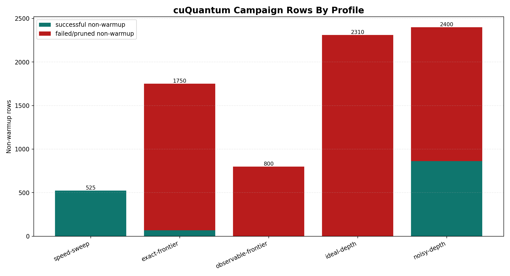
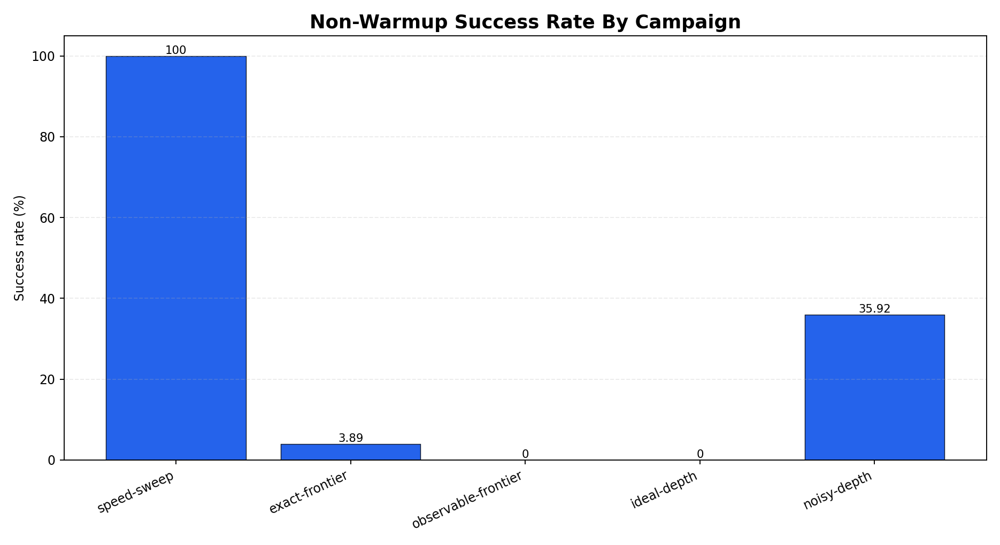
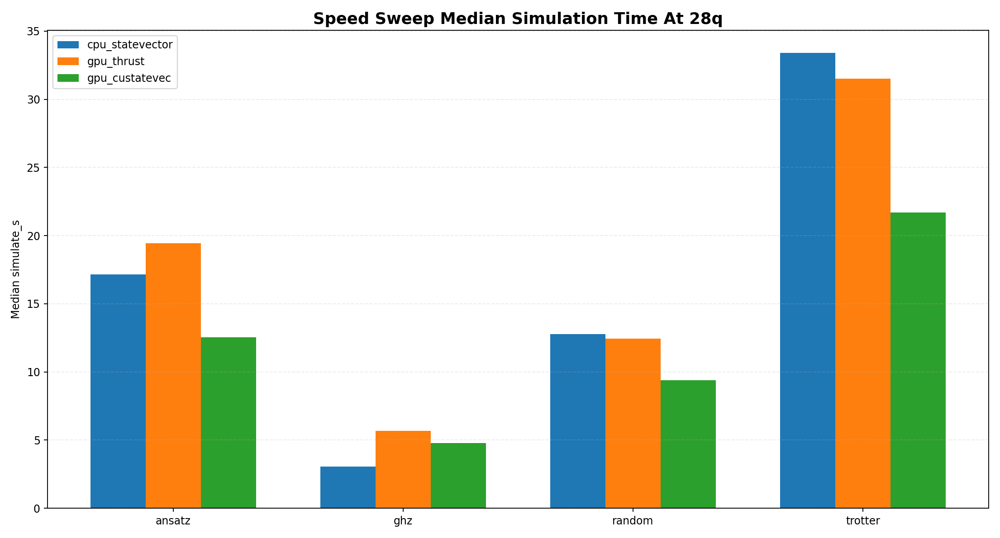
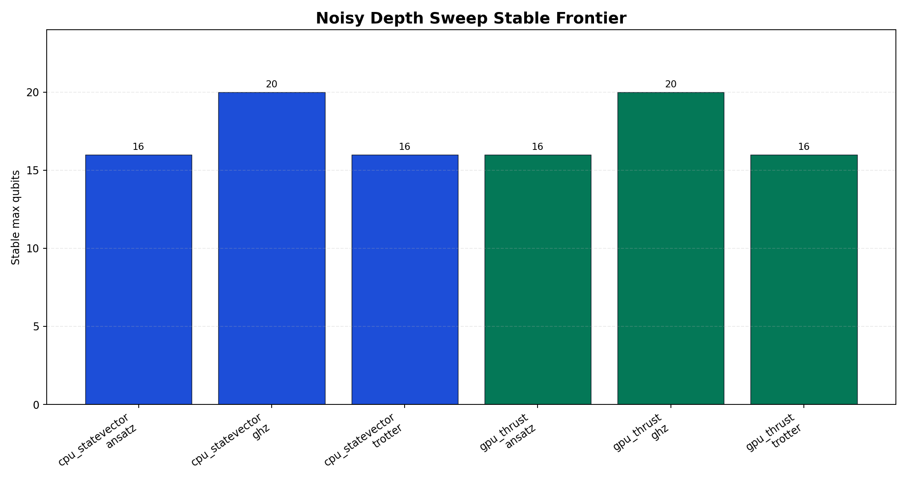
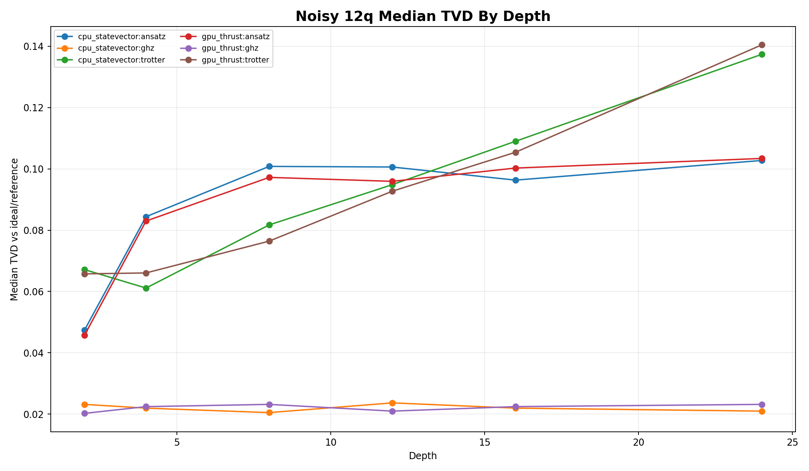

# cuQuantum Benchmark Campaign Report

This report is the public, GitHub-safe synthesis of the cuQuantum/Qiskit Aer benchmark campaign run on the current workstation. It intentionally summarizes the raw local `results/` and `logs/` directories instead of committing those machine-specific artifacts.

## Executive Summary

- Campaign profiles consolidated: `5`.
- Total rows recorded, including warmups: `10899`.
- Non-warmup rows: `7785`; successful non-warmup rows: `1455`; failed/pruned non-warmup rows: `6330`.
- Overall non-warmup success rate across all campaigns: `18.69%`.
- The speed sweep was the cleanest positive result: CPU statevector, GPU thrust, and GPU cuStateVec all completed through `28q` for GHZ, random, ansatz, and trotter.
- The exact frontier and observable/ideal frontier-style runs mostly served as failure-boundary probes. Their failures are kept as data because the point of these profiles is to push until the local WSL/GPU/hardware envelope breaks.
- The noisy depth sweep produced the most useful new science-facing data: CPU and GPU thrust remained stable through `20q` for GHZ and through `16q` for ansatz/trotter under the synthetic canonical noise profile.
- The appliance profiles were not included in the measured result set because Docker/NVIDIA Container Toolkit was not available on this machine at run time.

## How The Campaign Was Run

- Environment: WSL2 Ubuntu on Windows, Python `3.12.3`, Qiskit `1.4.5`, Qiskit Aer `0.15.1`, NVIDIA driver `581.42`, CUDA `13.0`, GPU `NVIDIA RTX A2000 12GB`.
- Execution model: the long campaign was launched from the Windows host and invoked WSL one case or persistent group at a time. This kept checkpointing alive even when individual WSL/GPU executions failed.
- Checkpointing: each completed row was appended to `resume-checkpoint.csv`; after each profile completed, the runner wrote final `results.csv`, `results.json`, `analysis-summary.json`, and `analysis-report.md` locally.
- Success accounting: warmups are recorded but not counted in headline success rates. Frontier pruning and WSL/timeouts are not discarded; they describe where the machine stopped being able to complete the requested workload.
- Public reporting: raw run directories stay local. This report publishes aggregate CSV/JSON summaries and selected PNG charts under `docs/`.

## Campaign Summary

| campaign_id | total_rows | non_warmup_rows | successful_non_warmup_rows | failed_non_warmup_rows | success_rate_non_warmup_pct | qubit_min | qubit_max |
| --- | --- | --- | --- | --- | --- | --- | --- |
| speed-sweep | 735 | 525 | 525 | 0 | 100.0 | 20 | 28 |
| exact-frontier | 2450 | 1750 | 68 | 1682 | 3.89 | 20 | 31 |
| observable-frontier | 1120 | 800 | 0 | 800 | 0.0 | 24 | 44 |
| ideal-depth | 3234 | 2310 | 0 | 2310 | 0.0 | 8 | 28 |
| noisy-depth | 3360 | 2400 | 862 | 1538 | 35.92 | 12 | 24 |

## Main Positive Results

### Speed Sweep

The speed sweep completed all non-warmup rows successfully. It is the strongest apples-to-apples timing comparison in this campaign because CPU, GPU thrust, and GPU cuStateVec all reached the top of the configured grid.

| variant | device | family | stable_max_qubits | median_simulate_s | median_speedup_vs_cpu | peak_rss_mb | peak_gpu_mem_mb |
| --- | --- | --- | --- | --- | --- | --- | --- |
| cpu_statevector | CPU | ansatz | 28 | 1.093 | 1.0 | 14675.738 | 576.617 |
| cpu_statevector | CPU | ghz | 28 | 0.1905 | 1.0 | 14674.988 | 576.617 |
| cpu_statevector | CPU | random | 28 | 0.8598 | 1.0 | 14675.758 | 576.617 |
| cpu_statevector | CPU | trotter | 28 | 2.0912 | 1.0 | 14679.242 | 576.617 |
| gpu_custatevec | GPU | ansatz | 28 | 1.1929 | 1.3688 | 14797.371 | 675.258 |
| gpu_custatevec | GPU | ghz | 28 | 0.3114 | 0.6609 | 14794.016 | 675.258 |
| gpu_custatevec | GPU | random | 28 | 0.8968 | 1.3599 | 14803.242 | 675.258 |
| gpu_custatevec | GPU | trotter | 28 | 1.9438 | 1.5403 | 14798.285 | 675.258 |
| gpu_thrust | GPU | ansatz | 28 | 1.7048 | 0.8915 | 14780.879 | 675.258 |
| gpu_thrust | GPU | ghz | 28 | 0.4136 | 0.5507 | 14779.336 | 675.258 |
| gpu_thrust | GPU | random | 28 | 1.1388 | 1.0345 | 14776.078 | 675.258 |
| gpu_thrust | GPU | trotter | 28 | 2.7831 | 1.0601 | 14782.293 | 675.258 |

### Noisy Depth Sweep

The noisy sweep used `synthetic_canonical_v1` and `counts` output. It shows a practical noisy frontier that is lower than the exact speed sweep frontier, as expected: noise, sampling, and deeper circuits make the workload materially harder.

| variant | device | family | stable_max_qubits | highest_success_qubits | first_failure_qubits | median_tvd | median_simulate_s | median_speedup_vs_cpu |
| --- | --- | --- | --- | --- | --- | --- | --- | --- |
| cpu_statevector | CPU | ansatz | 16 | 20 | 20 | 0.096503 | 12.4794 | 1.0 |
| cpu_statevector | CPU | ghz | 20 | 20 | 24 | 0.021973 | 3.5741 | 1.0 |
| cpu_statevector | CPU | trotter | 16 | 20 | 20 | 0.086597 | 11.9071 | 1.0 |
| gpu_thrust | GPU | ansatz | 16 | 20 | 20 | 0.096185 | 33.9645 | 0.5109 |
| gpu_thrust | GPU | ghz | 20 | 20 | 24 | 0.021484 | 8.0727 | 0.4425 |
| gpu_thrust | GPU | trotter | 16 | 20 | 20 | 0.088338 | 55.6522 | 0.3839 |

## Failure-Boundary Results

The exact frontier, observable frontier, and ideal depth campaigns intentionally pushed beyond stable operation. In these profiles, a failure row is still a useful result: it identifies a boundary condition for the local machine and software stack.

| campaign_id | non_warmup_rows | successful_non_warmup_rows | failed_non_warmup_rows | success_rate_non_warmup_pct | output_modes | qubit_min | qubit_max |
| --- | --- | --- | --- | --- | --- | --- | --- |
| exact-frontier | 1750 | 68 | 1682 | 3.89 | statevector | 20 | 31 |
| observable-frontier | 800 | 0 | 800 | 0.0 | marginal_probabilities | 24 | 44 |
| ideal-depth | 2310 | 0 | 2310 | 0.0 | marginal_probabilities statevector | 8 | 28 |

The observable frontier and ideal depth profiles completed as recorded campaigns but did not produce successful non-warmup measurements in this run. The dominant errors were WSL transport exits and grouped aborts after warmup failure, followed by frontier pruning where configured.

## Error Summary

| campaign_id | error_type | count | pct_of_failed_non_warmup |
| --- | --- | --- | --- |
| exact-frontier | frontier_pruned | 1681 | 99.94 |
| exact-frontier | wsl_exit_1 | 1 | 0.06 |
| observable-frontier | frontier_pruned | 800 | 100.0 |
| ideal-depth | group_aborted_after_warmup_failure | 2310 | 100.0 |
| noisy-depth | group_aborted_after_warmup_failure | 1460 | 94.93 |
| noisy-depth | group_aborted_after_repeat_failure | 59 | 3.84 |
| noisy-depth | QiskitError | 19 | 1.24 |

## Published Data Files

- `docs/data/cuquantum-campaign-summary.json`: structured public summary.
- `docs/data/cuquantum-profile-summary.csv`: spreadsheet of profile-level results.
- `docs/data/cuquantum-slice-summary.csv`: spreadsheet of variant/device/family slices.
- `docs/data/cuquantum-frontier-summary.csv`: spreadsheet of stable frontier and failure qubit levels.
- `docs/data/cuquantum-error-summary.csv`: spreadsheet of error types by campaign.
- `docs/data/cuquantum-depth-curves.csv`: spreadsheet of depth-curve medians by campaign, variant, family, qubits, and depth.

## Published Figures

- `docs/assets/cuquantum_campaign_rows_by_profile.png`
- `docs/assets/cuquantum_campaign_success_rate.png`
- `docs/assets/cuquantum_noisy_stable_frontier.png`
- `docs/assets/cuquantum_speed_sweep_28q_simulate_time.png`
- `docs/assets/cuquantum_noisy_tvd_by_depth_12q.png`

## Interpretation

- The current workstation can run sustained `28q` statevector speed sweeps on both CPU and GPU paths when the profile is controlled and the workload is exact/ideal.
- Noisy sampled circuits are harder: the stable noisy frontier is `20q` for GHZ and `16q` for ansatz/trotter on both CPU statevector and GPU thrust.
- cuStateVec and tensor-network paths should not be treated as automatically superior on this hardware. In the successful noisy rows, GPU thrust was often slower than CPU, and tensor-network success was sparse.
- WSL stability is a real operational variable in marathon campaigns. The repo now records WSL exits/timeouts instead of hiding them, because they define reproducibility boundaries on this machine.

## Reproduction Notes

- Raw local inputs were read from the gitignored `results/cuquantum-*` directories.
- Public assets were generated with `python scripts/generate_cuquantum_campaign_report.py` using only aggregate/sanitized fields.
- To rerun the public synthesis after new local results are produced, run the same generator from the repository root.
